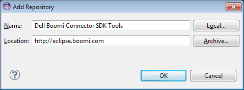
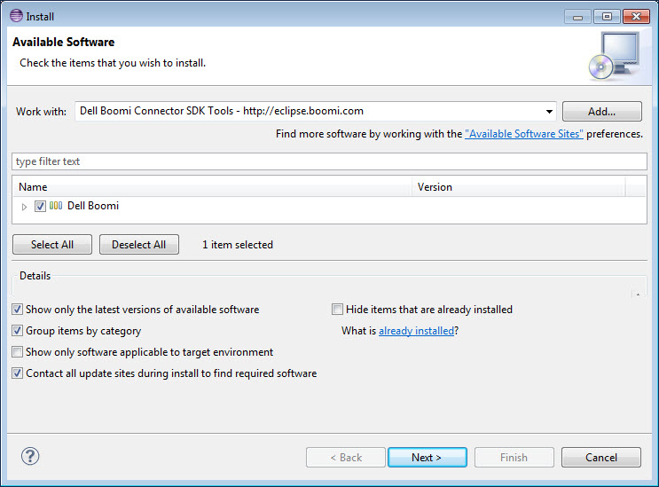

# Installing the connector SDK tools for Eclipse 

<head>
  <meta name="guidename" content="Integration"/>
  <meta name="context" content="GUID-8e4901b7-7cea-4d93-8821-cb4a02dba373"/>
</head>

By installing the Connector SDK Tools plug-in for Eclipse, you have the tools you need to quickly set up Eclipse projects for your connectors.

1.  In Eclipse, select **Help** \> **Install New Software…**.

    The Install wizard opens.

2.  Click **Add…**.

    The Add Repository dialog opens.

3.  In the **Name** field, type `Connector SDK Tools`.

4.  In the **Location** field, type `http://eclipse.boomi.com`.

    

5.  Click **OK**.

    You return to the Install wizard. appears in the software list.

6.  Select the **Boomi** check box .

    

7.  Click **Next**.

    The wizard advances to the Install Details screen.

8.  Click **Next**.

    The wizard advances to the Review Licenses screen.

9.  In the **License text** box, read the Connector SDK Tools license agreement.

    **Note:**

    You cannot install the Connector SDK Tools unless you accept the terms of the license agreement.

10. Select **I accept the terms of the license agreement**.

    The **Finish** button enables.

11. Click **Finish**.

    If a security warning displays indicating that the authenticity or validity of the software cannot be established, click **OK**.

    An alert box informs you that you must restart Eclipse for the installation to complete.

12. Do one of the following:

    -   To complete the installation now, click **Yes**.

    -   To wait to complete the installation until the next time you start Eclipse, click **No**.