# Performing a saved or advanced search in NetSuite 

<head>
  <meta name="guidename" content="Integration"/>
  <meta name="context" content="GUID-d034af61-466a-4cad-a6d5-d089481b62d8"/>
</head>

The NetSuite connector uses NetSuite's Basic and Advanced searches.

## About this task

The NetSuite connector requires the internal ID or script ID of the saved search defined in NetSuite. You can augment the search criteria by adding filters in the operation. You can also select the result columns you want returned in the document.

**Note:** In the October 2015 release, custom fields are supported in saved searches for all NetSuite versions supported by the connector.

## Procedure

1.  Create or open a **NetSuite Operation**.

2.  Set the **Connector Action** to **Query**.

    You do not need to check **Use Advanced Search** on this page.

    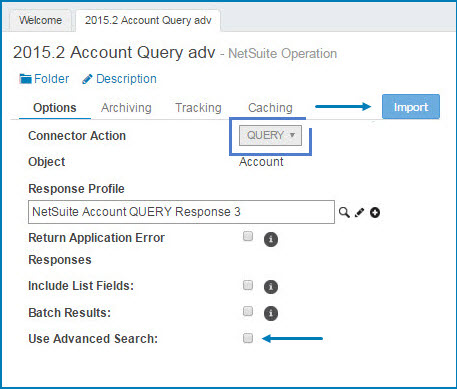

3.  Click the **Import** button.

4.  In the **Import Wizard**, turn on **Use Advanced Search**.

    This restricts the list of objects to those that support the Advanced Search option. The names of your saved searches do not appear in the list during the browse. Instead of selecting a search name, choose the record type for which your saved search was created and then reference your search by filtering on its internalID or scriptID.

    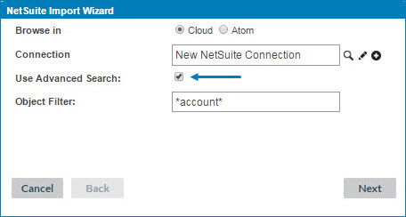

5.  Select the object type to import and then click **Next**.

    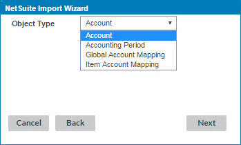

6.  Click **Finish** to complete and close the **Import Wizard**. When the **Import Wizard** finishes, it creates the profile.

    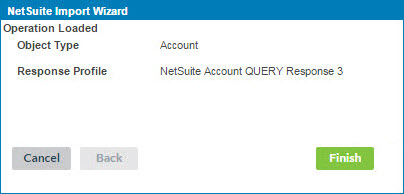

7.  By default, it selects all fields. In the **Operation**, on the **Fields** tab, toggle the parent on and off to clear the check boxes for the children.

    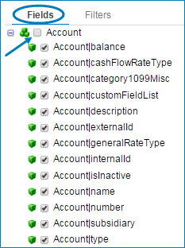

8.  Select the fields to return. If you select too many fields, the process can time out.

    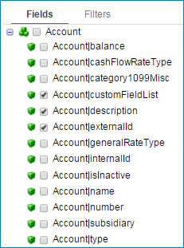

    OPTIONAL — Depending on the size of the object profile, some element values can be hidden from the response profile. Open the newly-created profile to confirm that you can expand the fields you selected in step 8. If the selected fields do not contain a searchValue element, proceed with steps 9 and 10.

9.  On the **Data Elements** tab, under the `<Object>SearchRow` root element, expand the **basic** object node by clicking on the plus sign.

    For each field you select to return in the operation, expand the XML element definition in the profile to expose the element containing the actual response value.

    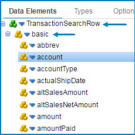

10. Click the blue arrow next to the secondary element and select **Expand Element**.

    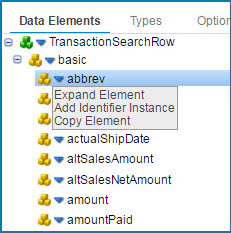

    This action adds a secondary searchValue element containing the value. The search values vary depending on the element type.

    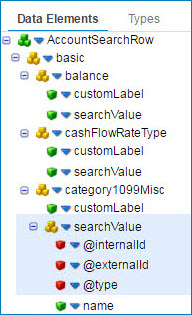

    The following steps apply only to Saved Searches.

11. On the Operation’s **Filters** tab, click the blue down arrow  next to **Filter**, then select **Add Logical Sub-Group**.

    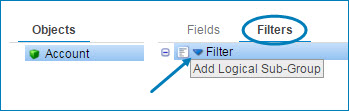

12. On the **Logical-And** filter, click the blue down arrow  then select **Add Expression**.

    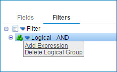

    The window expands showing Filter Name and Field.

13. Click the search icon .

14. In the **Choose a field** window, select either the `<Object>|savedSearchId` or `<Object>|savedSearchScriptID` then enter a **Filter Name**

    You can add other filters but you must add at least one of the two savedSearch filters. For more information see Changing a NetSuite saved search linked below.

    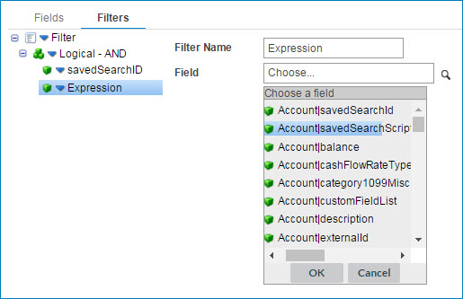

15. In the process, on the Connector’s **Parameters** tab, select the filters by clicking the plus button and choosing an input.

    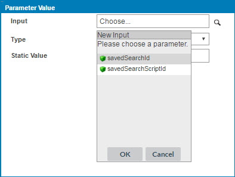

16. In the process, on the **Connector step**dialog, on the **Parameters** tab, edit the filters by highlighting a parameter and then clicking the pencil icon.

    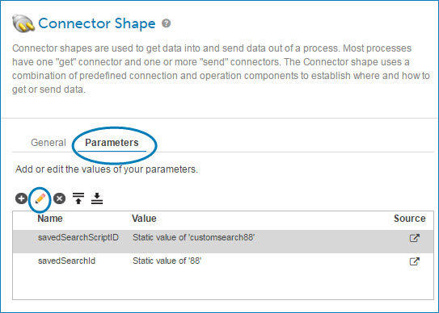

17. In the **Parameter Value** window, enter the internal ID or script ID for the saved search as a **Static** value. To obtain the ID value, in NetSuite edit the saved search and note the numeric internal ID in the browser URL or the script ID below the name, such as customersearch88.

    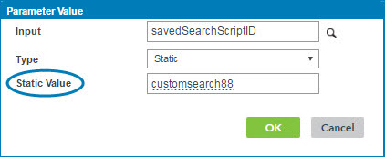

    When the search runs, it returns each row as a separate document.