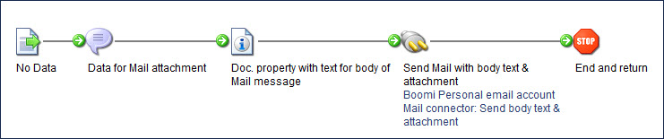

# Sending mail with body text and an attachment 

<head>
  <meta name="guidename" content="Integration"/>
  <meta name="context" content="GUID-20660876-cdd4-46cf-9723-7becb6dcb9a0"/>
</head>

By sending mail with body text as an attachment, the data added to the process \(in this example, the Message step\) is in an attachment in the email. The text added as a “Mail – Body” document property in the Set Properties step is in the body of the email message.

## Procedure

1.  Create a Mail Operation component.

    a.  Set the **Connector Action** field to **Send**.

    b.  Enter a from address, to address, and subject.

    c.  Set the **Disposition** field to **Attachment**.

    d.  Select an Attachment Content Type.

    e.  Select a Body Content Type.

    f.  Click **Save and Close**.

2.  Open or create a process.

3.  Add to the process canvas a step containing the data that you want to include as an attachment.

    In the example below, we added a **Message step** containing the data.

4.  Add the **Set Properties step** to the process.

    a.  Click the **Add Property** icon.

    b.  Select the **Document Property** property type.

    c.  Select **Standard Connectors** \> **Mail** \> **Body** and click **OK**.

    d.  In the left list, select **Mail – Body**, in the right list click the **Add Parameter** icon.

    e.  Add a parameter value containing the text that you want to include as body text in the email.

    In the example below, we selected **Static** as the Type and entered the body text in the **Static Value** field.

    f.  Click **OK** twice.

5.  Add a **Connector step** to the process.

    a.  Set the **Connector** field to **Mail** and the **Action** field to **Send**.

    b.  Select a connector connection.

    c.  Select the Mail Operation component that you created in the first step.

    d.  Click **OK**.

6.  Add these steps to your process. Connect the step containing the data for the attachment \(such as a Message step\) to the Set Properties step, and the Set Properties step to the Mail Connector step.

    For example:

    

7.  Click **Save**.

## Results

The data added to the process \(in the Message step, in this example\) is in an attachment in the email. The text added as a “Mail – Body” document property in the Set Properties step is in the body of the email message.