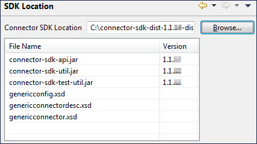

# Setting the connector SDK location preference for Eclipse 

<head>
  <meta name="guidename" content="Integration"/>
  <meta name="context" content="GUID-710d86d7-5533-4ccb-a4e2-02349b3dc48b"/>
</head>

After installing the Connector SDK Tools plug-in for Eclipse, you set the connector SDK location. After completing these steps, you are ready to create an Eclipse connector project.

## About this task

The Boomi Connector SDK Tools plug-in adds a preference to Eclipse that specifies the location in which you installed the Connector SDK.

## Procedure

1.  In Eclipse, select **Window** \> **Preferences**.

    The Preferences dialog opens.

2.  In the navigation tree, expand **Boomi**.

3.  Select **SDK Location**.

    The SDK Location section appears to the right.

4.  Click the **Browse** button adjacent to the **Connector SDK Location** field.

    The Browse for Folder dialog opens.

5.  Navigate to the folder in which the Connector SDK is installed and select the folder.

6.  Click **OK**.

    The Browse for Folder dialog closes and you return to the Preferences dialog. The Connector SDK files are listed below the **Connector SDK Location** field.

    

7.  Click **OK**.