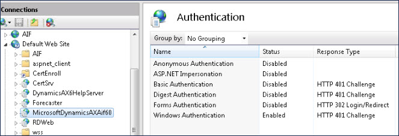

# Setting up web services for the Microsoft Dynamics AX connector 

<head>
  <meta name="guidename" content="Integration"/>
  <meta name="context" content="GUID-c0814717-ecac-4423-afa9-36f09115e543"/>
</head>

By setting up document exchange and setting up a web service that uses NTLM authentication, data can move into and out of Microsoft Dynamics AX.

## About the task

Complete this task before you create a Microsoft Dynamics AX connector.

## Procedure

1.  Create an inbound HTTP port:

    1.  Open MS Dynamics AX.

    2.  Go to **System administration** \> **Setup** \> **Services and Application Integration Framework** \> **Inbound ports**.

        The Inbound ports dialog opens.

    3.  Click **New** to create an inbound port.

    4.  In the Adapter field, select **HTTP.**

    5.  Configure the remaining fields, such as Port Name, URI, etc.

    6.  Select the services to expose.

        For more information, see the [Microsoft TechNet site](http://technet.microsoft.com/en-us/library/hh202090.aspx).

    7.  Configure the Processing options, Troubleshooting and Security settings.

2.  Configure the authentication schema for the port:

    1.  Select the inbound port that you created.

    2.  Next to the Adapter drop-down menu, click the **Configure** button.

        The WCF configuration editor opens.

    3.  In the warning dialog, click **Yes**.

    4.  In the Configuration pane on the left, select the **Bindings** folder.

    5.  In the Bindings pane on the right, click **New Binding Configuration...**.

        The Create a New Binding dialog opens.

    6.  Select **basicHttpBinding** and click **OK**.

    7.  On the Binding tab, in the **Name** field change the name to basicHttpBindingWithNTLM.

    8.  On the Security tab, in the **Mode** field enter TransportCredentialOnly.

    9.  Also on the Security tab, in the TransportClientCredentialType field select **Ntlm**.

    10. In the Configuration pane on the left, open the **Security** folder and the **Endpoints** sub-folder, and select the **reqReplyEndpoint**.

    11. In the Service Endpoint pane on the right, on the General tab, locate the **BindingConfiguration** field. Enter the configuration that you just created: basicHttpBindingWithNTLM.

    12. Save and close the WCF configuration editor.

        You return to the Inbound Ports dialog.

3.  To activate the inbound port, click **Activate**.

4.  Configure IIS:

    1.  Open the IIS Manager.

    2.  Verify that the authentication settings for the MicrosoftDynamicsAXAif60 application look like the settings in the following image:

        

    3.  Restart the IIS server to make sure that the changes are reflected.

5.  Validate the setup:

    1.  Use your web browser to get your WSDL.

    2.  The WSDL URL is the URI that you specified when you created the inbound port in step 1, with ?wsdl added to the end.

        For example: http://myhost:85/MicrosoftDynamicsAXAif60/myportname/xppservice.svc?wsdl

## Next steps

Set up a document exchange.