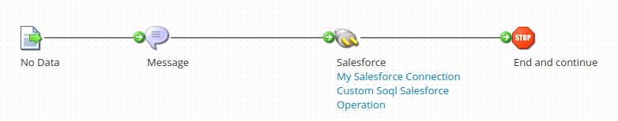
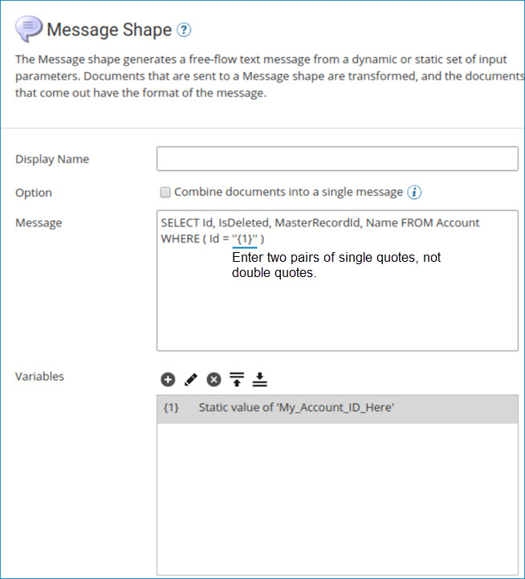
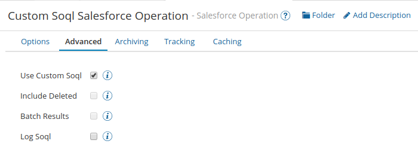

# Using custom SOQL in Salesforce Get operations 

<head>
  <meta name="guidename" content="Integration"/>
  <meta name="context" content="GUID-5c1dc4ea-08f9-4139-91e9-527a4d7f5cde"/>
</head>


Custom SOQL allows you to create advanced and complex queries and insert the custom SOQL into the Salesforce connector's Get operations.

## About this task

By using custom SOQL, you can increase the performance and efficiency of your queries and extend the   SOQL builder by using operators such as LIKE and COUNT. For example, you can use the following custom SOQL statement to select and retrieve customer records from the Account object:

```
SELECT Id from Account where BillingCity = ‘Atlanta’ and (NOT BillingZip like ‘33%’)
```

You typically use the Message step to send custom SOQL as an input document to the Salesforce connector's Get operation. You can send multiple SOQL queries as multiple documents to retrieve records. Custom SOQL is not supported for bulk operations.

## Procedure

1.  Build the SOQL.

    When building the SOQL, be aware of certain SOQL feature limits. For more information, see the [SOQL and SOSL Limits](https://developer.salesforce.com/docs/atlas.en-us.salesforce_app_limits_cheatsheet.meta/salesforce_app_limits_cheatsheet/salesforce_app_limits_platform_soslsoql.htm) topic in the Salesforce Developer documentation.

2.  In , build the process to move and process the Salesforce data.

    The process appears on the process canvas, as shown in the following image:

    

3.  In the process, copy the SOQL into the step \(typically the Message step\) that comes before and is connected to the Salesforce connector. This step provides an input document to the Salesforce connector's Get operation.

    The Message step appears, as shown in the following image:

    

4.  In the Salesforce connector operation's Get action, click the **Advanced** tab and select **Use Custom Soql**. If the operation already has an object configuration with fields, filters, and sorts that is created by an import, the configuration is removed when you select **Use Custom Soql**. This happens because the connector expects the SOQL to be passed as an input document to the connector.

    The Salesforce operation Advanced tab appears, as shown in the following image:

    