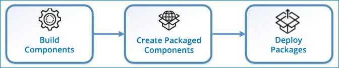

# Deployment workflow 

<head>
  <meta name="guidename" content="Integration"/>
  <meta name="context" content="GUID-c785c476-f1b3-413b-a5a5-57afcc98978f"/>
</head>

The workflow for deploying a process or component to an environment involves building the component, creating a packaged component, and then deploying the packaged component.

The basic steps to successfully deploying a process or component are as follows:

1. A developer builds a process or deployable component on the **Build** page.

2. A developer or administrator creates a version of the component by creating a "packaged component" from the **Build** page or the **Packaged Component** page.

3. An administrator deploys the packaged component to one or more environments from the **Packaged Component** page or the **Deployments** page.

After a packaged component is deployed, you can use the Deployments page to manage your active deployments.

The following illustration shows the basic steps for building and deploying.

