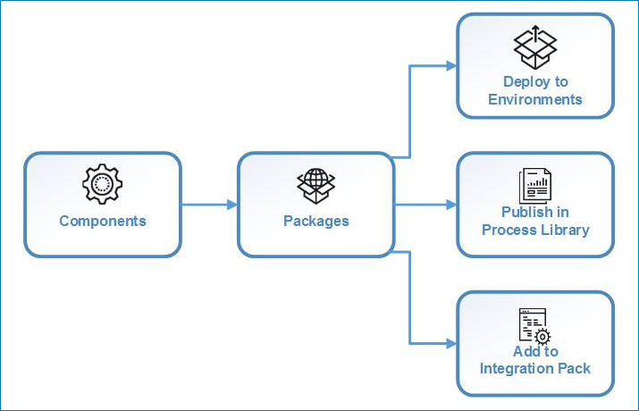

# Package management 

<head>
  <meta name="guidename" content="Integration"/>
  <meta name="context" content="GUID-345b55c1-5242-4f34-83a8-d8c58522e8e1"/>
</head>

Packaging a component or process that you have built is the first step in deployment. Deployable components must be packaged before they can be deployed or shared, either in the Process Library or as part of an integration pack.

A package represents a point in time during the development of a process or component. You might want to create a package when initial development is complete, and then again after testing has been performed and fixes have been applied. You could also tie your packages to some larger milestones, such as the coordinated rollout of an integration project.

For processes, API Service/Proxy components, and Processing Group components, a package consists of the primary component and all the dependent components that are required to support that component (such as subprocesses, connectors, or maps). For other deployable components (such as certificates), a package is the component itself.

Each time you package a process or component, a new *version* of the package is created. You can specify an alphanumeric version ID that suits your needs, such as 1.0, Version 1.0, or Alpha Release. The version ID that you specify uniquely identifies that version of the package and stays with the version no matter where it is deployed or shared.

You create and manage deployable packages from the **Package Manager** page (**Deploy** > **Package Manager**). In addition to creating new packages, you can:

- Review a component's package history
- Display detailed information about a specific package version
- Compare two versions of a package
- Determine whether a package is being used and where

:::note

You must have the Package Management privilege to create and manage deployable packages.

:::

You can also package processes and components from the **Build** page provided that you have both the Build Read and Write Access privilege and the Package Management privilege.

## Package usage 

Packages give you greater control over the life cycle and distribution of your processes and components. By packaging a component and giving it a unique version ID, you can keep track of where each version is being used and whether the same version is being used in more than one place. And if you make a package shareable, that same package with its unique version ID can be:

- Deployed to one or more environments
- Published in the Process Library
- Added to an integration pack

All packages can be deployed, but only packages that were marked as shareable when they were created can be published in the Process Library or added to an integration pack. Furthermore, only certain types of packaged components can be shared:

- Processes that do not contain Process Route components can be shared in the Process Library.
- API Service components and processes that do not contain Process Route components can be added to an integration pack.
- Other types of deployable components \(such as certificates and custom libraries\) can be deployed, but they cannot be shared.

The following illustration shows how a package that has been marked as shareable can be used in multiple ways.

