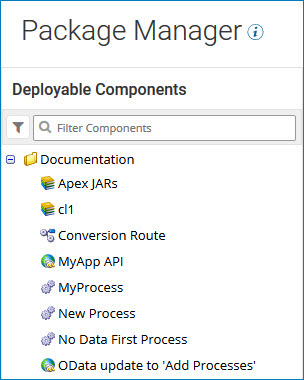

# Search for components to package 

<head>
  <meta name="guidename" content="Integration"/>
  <meta name="context" content="GUID-b7e0276b-4abf-447d-865a-f07458d5b80e"/>
</head>

Search in the Package Manager components list to find the components that you want to package.

On the Package Manager page, the components list displays all deployable components in the current account in alphabetical order. If some components are stored in folders, the folders appear alphabetically as well.

At the top of the components list there is a filter icon and a search box. You can search for components to package by name or component ID, or filter the list by:

- Deployed status
- Component type
- Package status
- Package version

:::note

The components list appears empty when no deployable components are created or too many search filters are applied.

:::
