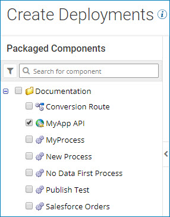

# Search for packages to deploy 

<head>
  <meta name="guidename" content="Integration"/>
  <meta name="context" content="GUID-b50f978f-067b-4d50-b480-906dcc9e04d7"/>
</head>

Search for packaged components to deploy from the packages list on the Select Packages page.

When you deploy packages from the Deployments page, the Create Deployments wizard shows you a list of packages that are available to be deployed. The packages list on the Select Packages page displays all available packages in the current account in alphabetical order. If some packages are stored in folders, the folders appear alphabetically as well.

At the top of the packages list there is a filter icon and a search box. You can search for packages to deploy by name, or filter the list by:

- Component type
- Deployment status
- Package version

