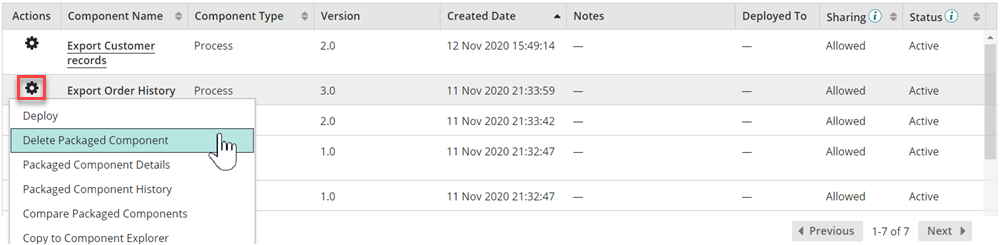

# Deleting a packaged component version 

<head>
  <meta name="guidename" content="Integration"/>
  <meta name="context" content="GUID-915305f3-d5fb-4eaf-b0f3-f789cd25f18a"/>
</head>

You can delete a specific version of a packaged component from the **Deploy** \> **Packaged Component** page.

## About this task

As an integration developer, you may want to delete a packaged component version to ensure it does not get used \(like in a deployment, for example\). A packaged component version is not eligible for deletion if it is currently deployed to one or more environments, is published to the Process Library, or is released as part of an integration pack.

## Procedure

1. From the list in the Packaged Components page \(**Deploy** \> **Packaged Components**\), locate a version of a packaged component that you want to delete.

2. In the same row as the packaged component, click the  **Action menu** icon and select **Delete Packaged Component** from the list of options.

3. Click **OK** to continue with the deletion, or **Cancel** to return to the Packaged Components page without making any changes.

    Packaged components cannot be deleted if it is currently in use.

## Results

The selected packaged component version is successfully deleted. To view a list of deleted packaged component versions on your account, apply the **Deleted Packaged Component** filter at the top of the packaged components table. Because deleted packaged components can be restored, please note that a version value cannot be reused in a new packaged component if a deleted packaged component already has that value.