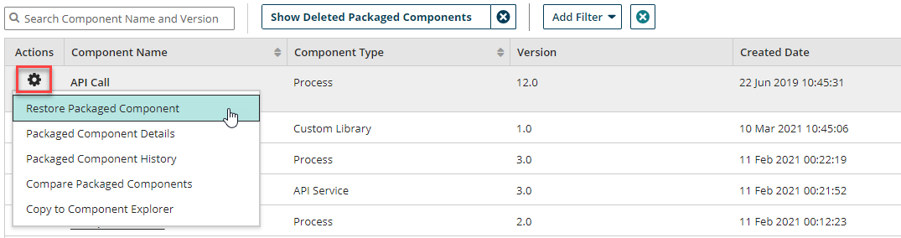

# Restoring a deleted version of a packaged component 

<head>
  <meta name="guidename" content="Integration"/>
  <meta name="context" content="GUID-16728786-24a0-4b55-8670-8a88588c819f"/>
</head>

You can restore a deleted version of a packaged component from the **Deploy** \> **Packaged Component** page.

## About this task

As an integration developer, you may want to restore a deleted packaged component version to make it active for use in a deployment, an integration pack, or the Process Library.

## Procedure

1. From the list in the Packaged Components page \(**Deploy** \> **Packaged Components**\), apply the **Show Deleted Packaged Component** filter at the top of the packaged components table.

    A list of deleted packaged component versions appears in the results. Use the Status column to sort by **Active** and **Deleted** statuses.

    :::note
    
    If the status column does not show any deleted packaged component versions after applying the filter, this means there are no deleted packaged components on the account at this time.

    :::

2. In the same row as the packaged component with a "Deleted" status, click the  **Action menu** icon and select **Restore Packaged Component** from the list of options.

## Results

Your packaged component is now restored and has a status of Active in the packaged components table. Once a packaged component version is restored, it is again eligible for deployment and inclusion in the Process Library and integration packs.
