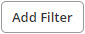

# Searching for packaged components by using filters 

<head>
  <meta name="guidename" content="Integration"/>
  <meta name="context" content="GUID-52430ca7-259c-4e92-b484-7f391e529b1f"/>
</head>

Use the filter options on the Packaged Components list to find specific packaged components.

## Procedure

1. From the **Deploy** menu, click **Packaged Components**.

2. At the top of the packaged components list, click the **Add Filter**  button.

    The filter dialog opens.

3. Select one or more of the following filters:

    - **Component** — Filter by the exact name of any packaged component created on the account.

    - **Component Type** — Filter to show only a specific type of component or components.

    - **Sharing** — Search for components that are allowed or not allowed to be shared publicly to the process library or integration packs.

    - **Show Deleted Packaged Components** — Show packaged components with a status of "Deleted" in the Packaged Components table. A deleted status means that a specific version of a packaged component is deleted from use and cannot be used in a deployment, the Process Library, or integration packs. After applying the filter, the Status column is sortable by either active or deleted statuses.

:::note

The Packaged Components page only displays active status packaged components by default. You must first apply the "Show Deleted Packaged Components" filter to both view and sort by deleted packaged components.

:::

    - **Packaged Component ID** — The value that you specify must be an exact match for a component's package version.

:::note

Find the Packaged Component ID by locating a packaged component, and click on the **Action menu** \> **Packaged Component Details** option.

:::

    You can select any combination of filters. A component must match all selected filters to be included in the list.

4. Click **Apply**.  
    The packaged components that match the combination of filters you selected appear in the list of results.

5. (Optional) To select different filters, click the filter icon, change your selections, and click **Apply**.

6. To reset the list, do one of the following: click the filter icon and click **Clear all filters**.

    - Click the **Clear**  icon.

    - Click the **Clear All Filters**  icon to remove multiple applied filters at one time.
    