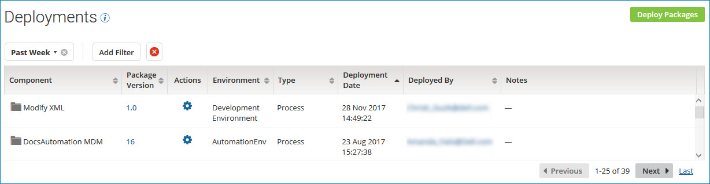

# Deployments page

<head>
  <meta name="guidename" content="Integration"/>
  <meta name="context" content="GUID-1100D6F0-A235-4D25-9F72-5A4125DEEB50"/>
</head>

The **Deployments** page \(**Deploy** \> **Deployments**\) lets you manage active deployments and create new deployments. A *deployment* consists of a single version of a package that has been deployed to a specified environment.

:::note

You must have the Process Deployment privilege to access this page.

:::

The Deployments page shows a list of all the packages that are *actively* deployed, including all types of components in all environments. If you undeploy a package, it is removed from the list of deployments. if you deploy a different version of a package, the new package version is displayed and the previous package version is removed from the list. To display all the deployments for a given package over time, you can use the **View Deployment History** action.

:::note

A date filter of **Past Week** is applied to the list by default. You can change the date filter or clear it.

:::

The list of deployments that you see is limited by the environments to which you have access.

By default, the list of deployments is sorted by deployment date in descending order. You can also sort the list by:

- Component name
- Package version
- Deployment environment
- Component type
- The user who deployed the package

**Component**  
The name of the component that was packaged and deployed.

**Package Version**  
An alphanumeric value that identifies the package version.

The package version was specified by the user who created the package.

**Actions**  
You can use the ** Actions** menu to perform the following actions for a deployment:

- **View Deployment History** — View the package's deployment history.

- **Compare Deployed Package** — Compare a deployed package with another version of that package.

- **Copy to Component Explorer** — Copy a deployed package to a different folder in the Component Explorer.

- **Undeploy** — Undeploy the package from the environment where it is deployed.

**Environment**  
The name of the environment where the package is deployed.

**Type**  
The type of component that was packaged and deployed.

**Deployment Date**  
The date and time at which the package was deployed.

**Deployed By**  
The email address of the user who deployed the package.

**Notes**  
Notes that describe the deployment, if any were provided.
