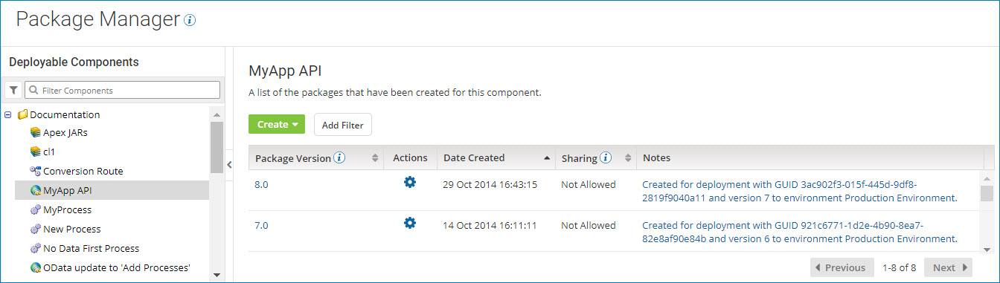

# Package Manager page

<head>
  <meta name="guidename" content="Integration"/>
  <meta name="context" content="GUID-C3CD9DE6-AC02-48AE-B02C-96F294E6184F"/>
</head>

The **Package Manager** page \(**Deploy** \> **Package Manager**\) lets you create and manage deployable packages for the components that you build.

:::note

You must have the Package Management privilege to access this page.

:::

When you select **Package Manager** from the **Deploy** menu, the Package Manager landing page is displayed.

When you select a component from the Deployable Components list, the Package History table is displayed.

By default, packages are sorted by the date created in descending order. You can also sort the list by:

- Package version
- Whether or not the package can be shared

**Package Version**  
An alphanumeric value that identifies the package version.

The package version was specified by the user who created the package.

**Actions**  
You can use the ** Actions** menu to perform the following actions for a package version:

- **Compare Package** — Compare two versions of a package.

- **Copy to Component Explorer** — Copy a package to a different folder in the Component Explorer.

- **Show Usage** — Determine if a package is being used and where it is being used.

**Date Created**  
The date and time at which the package version was created.

**Sharing**  
Indicates whether the package version can be shared in the Process Library or as part of an integration pack.

All packages can be deployed, but only packages that were marked as shareable when they were created can be published in the Process Library or added to an integration pack.

This field appears only for API Service components and processes that do not contain Process Route components. Other types of deployable components \(such as certificates, custom libraries, and API Proxy components\) can be deployed, but they cannot be shared.

**Notes**  
Notes that describe the package version, if any were provided.
