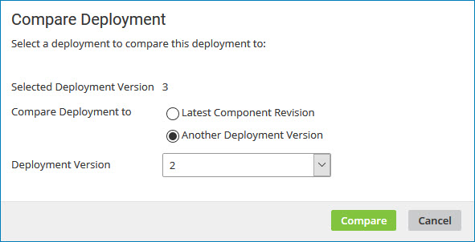
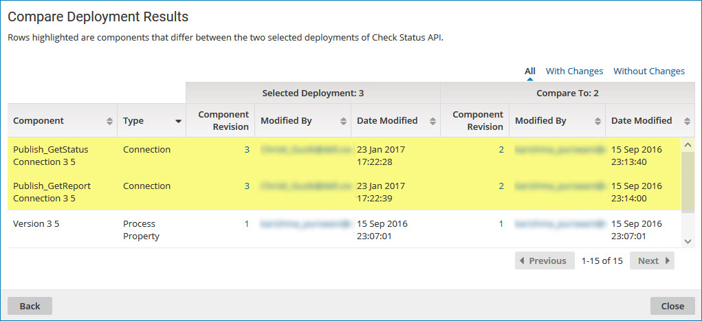

# Comparing the contents of two deployments

<head>
  <meta name="guidename" content="Integration"/>
  <meta name="context" content="GUID-8ed53427-d5d2-4e0b-8b85-197eda9023dd"/>
</head>

On the **Deployments** page, use the **Compare Deployment** action to compare the contents of two deployments.

A deployment consists of a single version of a packaged component that has been deployed to a specified environment. This comparison provides an historical view of deployments over time.

## Procedure

1. On the **Deployments** page, click the ** Actions** menu for a deployed package and select **View Deployment History**.

    The Deployment History panel is displayed.

2. In the ** Actions** menu for a deployment, select **Compare Deployment**.

    The Compare Deployment dialog opens with the selected version in the **Selected Deployment Version** field.

    

3. In the **Compare Deployment to** field do one of the following:

    - Select **Latest Component Revision**.
    - Select **Another Deployment Version** and select a version number from the drop-down list.

4. Click **Compare**.

    The comparison results are displayed. Differences between the two deployment versions are highlighted.

    

5. To contact the user who last modified a specific component within either version of the deployment, click the email address in the **Modified By** field.

    Your email application opens with the user's name in the **To** field of a new message.

6. To select a different version with which to compare, click **Back** and repeat steps 3 and 4.

7. When you are done comparing the two deployment versions, click **Close**.
