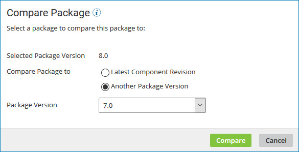
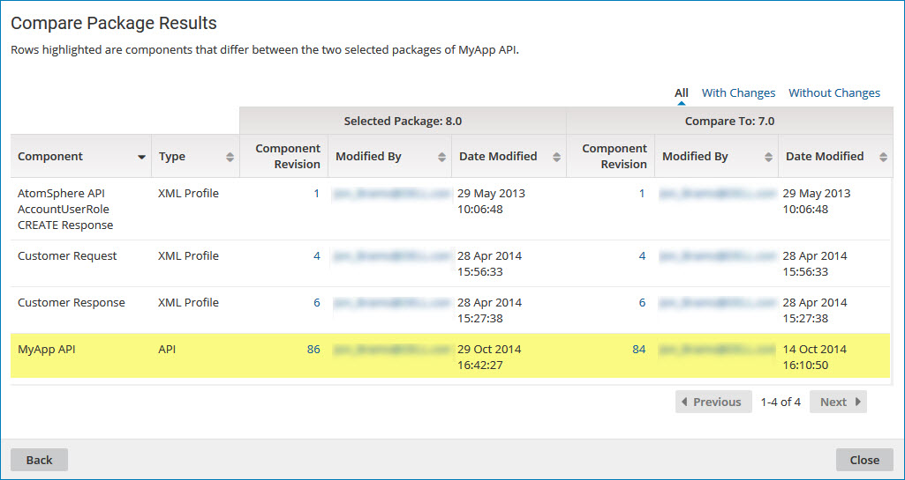

# Comparing two versions of a package

<head>
  <meta name="guidename" content="Integration"/>
  <meta name="context" content="GUID-cfa2bccf-6612-4861-b1e9-c60eeb28b888"/>
</head>

On the **Package Manager** page, use the **Compare Package** action to compare two versions of a component package.

## Procedure

1. On the **Package Manager** page, select a component in the Component Explorer.

    The Package History table is displayed.

2. Click the **Actions** icon  for the package version that you want to compare and select **Compare Package**.

    The Compare Package dialog opens with the selected version in the **Selected Package Version** field.

    

3. In the **Compare Package to** field do one of the following:

    - Select **Latest Component Revision**.
    - Select **Another Package Version** and select a version ID from the drop-down list.

4. Click **Compare**.

    The comparison results are displayed. Differences between the two package versions are highlighted.

    

5. To contact the user who last modified a specific component within either version of the package, click the email address in the **Modified By** field.

    Your email application opens with the user's name in the **To** field of a new message.

6. To select a different version with which to compare, click **Back** and repeat steps 3 and 4.

7. When you are done comparing the two package versions, click **Close**.
