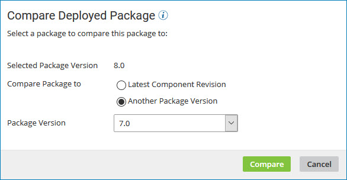
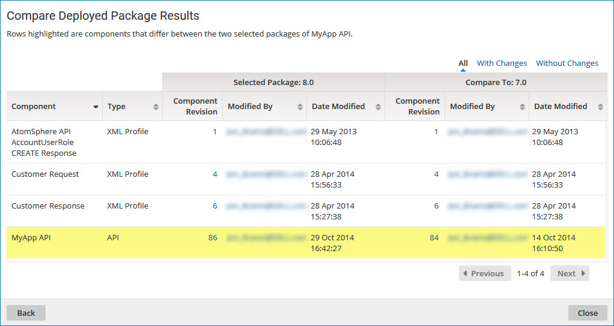

# Comparing two versions of a deployed package

<head>
  <meta name="guidename" content="Integration"/>
  <meta name="context" content="GUID-3cadb1a8-85c0-4286-83a2-b43d36ea570b"/>
</head>

On the **Deployments** page, use the **Compare Deployed Package** action to compare two versions of a deployed package.

This following can help you determine why you might view another version of a package:

- To identify differences for the purpose of troubleshooting
- To decide if you want to deploy a newer version of the package or redeploy an older version of the package

1. On the **Deployments** page, click the ** Actions** menu for a deployed package and select **Compare Deployed Package**.

    The Compare Deployed Package dialog opens with the selected version in the **Selected Package Version** field.

    

2. In the **Compare Package to** field do one of the following:

    - Select **Latest Component Revision**.
    - Select **Another Package Version** and select a version ID from the drop-down list.

3. Click **Compare**.

    The comparison results are displayed. Differences between the two package versions are highlighted.

    

4. To contact the user who last modified a specific component within either version of the package, click the email address in the **Modified By** field.

    Your email application opens with the user's name in the **To** field of a new message.

5. To select a different version with which to compare, click **Back** and repeat steps 3 and 4.

6. When you are done comparing the two package versions, click **Close**.
