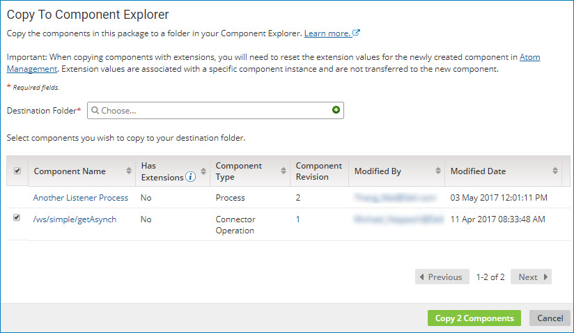

# Copying the components in a package to the Component Explorer

<head>
  <meta name="guidename" content="Integration"/>
  <meta name="context" content="GUID-ed588b4f-dec0-4450-aa0f-2b0bb1fc0478"/>
</head>

From the **Package Manager** page or the **Deployments** page, use the **Copy to Component Explorer** action to copy the components in a package to a different folder in the Component Explorer.

## About this task

Copying a package to the Component Explorer creates copies of the components in that package to a new folder. You can copy components whether or not their packages have been deployed. The newly copied components must be packaged before they can be deployed.

## Procedure

1. On the **Package Manager** page \(**Deploy** \> **Package Manager**\), select a component in the Component Explorer.

    The Package History table is displayed.

    **Note:** You can also copy the components in a package to the Component Explorer from the **Deployments** page \(**Deploy** \> **Deployments**\) or the Deployment History panel. The remaining steps in this task are the same from any location.

2. Click the **Actions** icon  for the package version that you want to copy and select **Copy To Component Explorer**.

    The Copy To Component Explorer dialog opens.

    

    For processes, API Service components, and Processing Group components, a package consists of the primary component and all the dependent components that are required to support that component \(such as subprocesses, connectors, or maps\). For other deployable components \(such as certificates and API Proxy components\), a package is the component itself.

    By default, the primary component is listed first, followed by any dependent components. You can also sort the list of components that make up the package by:

    - Whether or not the component has extensions
    - Component type
    - User who last modified the component
    - Date and time at which the component was last modified

3. In the **Destination Folder** field, do one of the following:

    - Click the **Choose** icon to locate an existing folder.

        If the destination folder is write-protected and you are not assigned a user role that allows write access to the folder, you can see the folder but you cannot select it.

    - Click ** Create** to create a new folder.

4. To remove a dependent component from the list of components that will be copied, turn the component's check box off.

    You can copy all components or select one or more components. The primary component is always copied and its check box cannot be turned off.

    :::note
    
    If you choose not to copy any of the dependent components, the newly copied primary component will continue to refer to the original dependent components.

    :::

5. To open a specific component within the package, click the name in the **Component Name** field.

    The Build page opens in a separate browser tab or window with the selected component displayed.

6. To contact the user who last modified a specific component within the package, click the email address in the **Modified By** field.

    Your email application opens with the user's name in the **To** field of a new message.

7. When you are ready to copy the selected components, click **Copy n Components**.

    If any of the components have extensions defined \(as indicated in the **Has Extensions** field\), the component is copied but the extension values are not. You do not have to redefine the extensions in the copied component, but you do have to reset the extension values for component. You set extension values on the Extensions dialog in Atom Management.
    