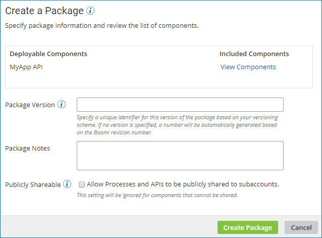

# Creating a single package from Package Manager 

<head>
  <meta name="guidename" content="Integration"/>
  <meta name="context" content="GUID-2f34b35e-5a50-448c-8b6e-dd5093d02529"/>
</head>

Use the Package wizard on the **Package Manager** page \(**Deploy** \> **Package Manager**\) to create a single deployable package.

## Before you begin

You must have the Package Management privilege to perform this task.

## About this task

You can create a package for any deployable component from the **Package Manager** page.

## Procedure

1. From the **Deploy** menu, select **Package Manager**.

    The Package Manager landing page is displayed.

2. In the components list, select the component that you want to package so that it is highlighted, but do not select its check box.

    The Package History table is displayed with a list of previously created packages, if any.

3. In the **Create** drop-down list, click **New Package**.

    The Create a Package dialog is displayed.

    

4. In the **Deployable Components** section, click **View Components** to review the list of components that are included in the package.

    For processes, API Service components, and Processing Group components, a package consists of the primary component and all the dependent components that are required to support that component \(such as subprocesses, connectors, or maps\). For other deployable components \(such as certificates\), a package is the component itself. 

    You can review the list of components, but you cannot modify it.

5. Provide the following information:

    - **Package Version** - A unique identifier for this version of the component package.

      You can specify any alphanumeric value that will help you identify the package. For example, your versioning scheme might consist of 1.0, 1.1, 1.2, 2.0, etc.

      If you do not specify your own package version, a value will be automatically generated based on the component's revision number.

    - **Package Notes** - (Optional) Descriptive notes to help you identify the package version.

      For example, you could use this field to describe changes that were made for this version of the package or to identify what release the package version is a part of.

    - **Publicly Shareable** - (Optional, for processes and API Service components only) To share the package publicly in a process library or as part of an integration pack, select this check box.

      :::note
      
      The Publicly Shareable option is ignored for components that cannot be shared.

      :::

6. Click **Create Package**.

## Results

The new package appears in the Package History table.

If the specified **Package Version** value already exists for this component, an error message is displayed.

After you create the package, you can deploy it to one or more environments or share it in a process library or integration pack, if appropriate.
