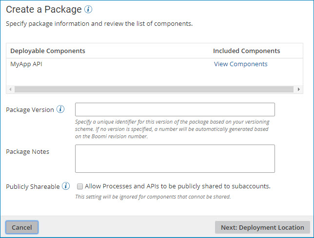
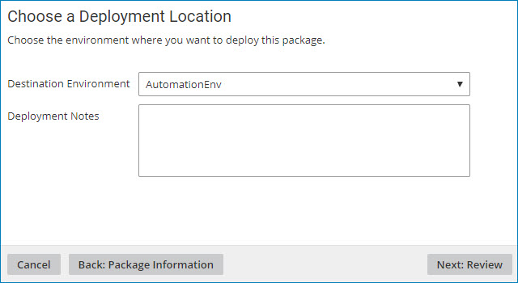
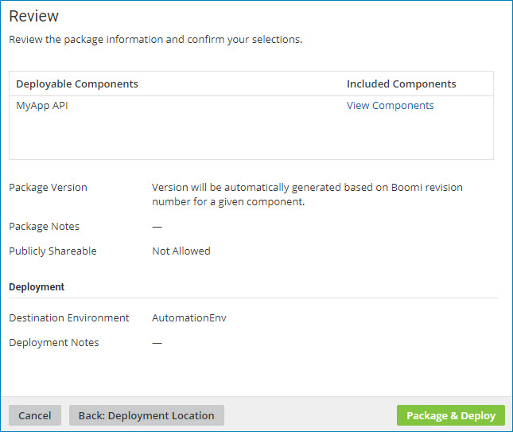

# Creating and deploying packages from Package Manager 

<head>
  <meta name="guidename" content="Integration"/>
  <meta name="context" content="GUID-a61138d5-8224-42df-9f93-45f4ac96813d"/>
</head>

From the **Package Manager** page, package components and deploy them to a runtime environment.

You must have the Package Management privilege and the Process Deployment privilege to perform this task.

You can create one or more packages — a maximum of 250 packages at one time — and deploy them directly from **Package Manager**.

1. From the **Deploy** menu, select **Package Manager**.

    The Package Manager landing page is displayed.

2. In the components list, navigate to the folder containing the component\(s\) that you want to package and do one of the following:

    - Select a single component that you want to package so that it is highlighted, but do not select its check box.

        The Package History table is displayed with a list of previously created packages, if any.

    - Select the check boxes for one or more folders or individual components.

        The Components to Package table appears with the components that you selected.

3. In the **Create** drop-down list, click **New Package & Deploy**.

    The Create a Package dialog is displayed.

    

    **Note:** The Create a Package dialog for multiple components varies slightly from this sample screen.

4. In the Create a Package dialog, perform the following steps:

    1. In the **Deployable Components** section, click **View Components** to review the list of components that are included in a given package.

        For processes, API Service components, and Processing Group components, a package consists of the primary component and all the dependent components that are required to support that component \(such as subprocesses, connectors, or maps\). For other deployable components \(such as certificates and API Proxy components\), a package is the component itself.

        You can review the list of components, but you cannot modify it.

    2. Provide the following information:

        **Package Version \(or Version for All Packages\)**  
        A unique identifier for this version of the component package\(s\).

        You can specify any alphanumeric value that will help you identify the package\(s\). For example, your versioning scheme might consist of 1.0, 1.1, 1.2, 2.0, etc.

        If you do not specify your own package version, a value will be automatically generated based on the component's revision number. For multiple components, a separate value will be generated for each package based on the component's revision number.

        **Package Notes \(or Notes for All Packages\)**  
        \(Optional\) Descriptive notes to help you identify the package version.

        For example, you could use this field to describe changes that were made for this version of the package\(s\) or to identify what release the package version is a part of.

        **Publicly Shareable**  
        \(Optional, for processes and API Service components only\) To share the package\(s\) publicly in a process library or as part of an integration pack, select this check box.

        **Note:** The Publicly Shareable option is ignored for components that cannot be shared.

    3. Click **Next: Deployment Location**.

        The Choose a Deployment Location dialog is displayed.

        

5. In the Choose a Deployment Location dialog, perform the following steps:

    1. In the **Destination Environment** drop-down list, select the environment where you want to deploy the package\(s\).

    2. In the **Deployment Notes** field, specify descriptive notes about this deployment.

    3. Click **Next: Review**.

        The Review dialog is displayed.

        

6. Review your package and deployment information, then click one of the following:

    - **Package & Deploy** to create the package\(s\) and deploy them to the specified environment.

        :::note 
        
        If the specified environment was deleted or you no longer have permission to deploy to that environment upon clicking **Package & Deploy**, the wizard closes and you receive an error message. You need to re-execute the wizard to deploy to another environment.

        :::

    - **Back: Deployment Location** to return to the Choose a Deployment Location dialog.

    - **Cancel** to cancel the request and return to the Package Manager page.

    When you click **Package & Deploy**, a confirmation dialog is displayed. In the confirmation dialog:

    - Clicking **Go to Deployments** closes the confirmation dialog and opens the Deployments page in a new tab or window.
    - Clicking **Close**closes the confirmation dialog and redisplays the Package Manager page.
    