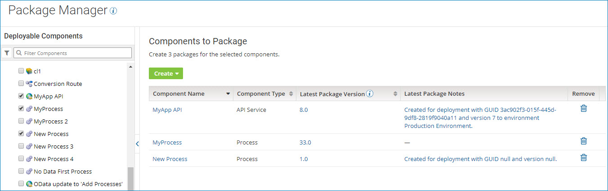
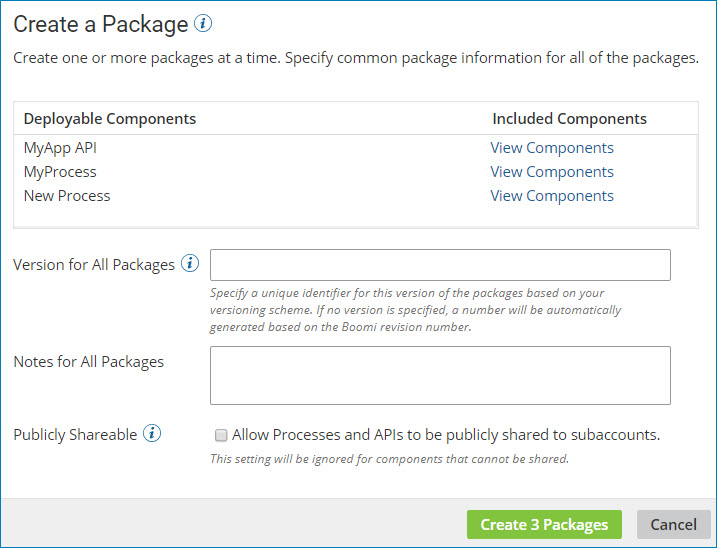

# Creating multiple packages from Package Manager 

<head>
  <meta name="guidename" content="Integration"/>
  <meta name="context" content="GUID-36c6b76d-c453-4a32-9c66-8a65f4317b91"/>
</head>

Use the Package wizard on the **Package Manager** page \(**Deploy** \> **Package Manager**\) to create one or more deployable packages.

## Before you begin

You must have the Package Management privilege to perform this task.

## About this task

You can create packages for multiple deployable components from the **Package Manager** page.

## Procedure

1. From the **Deploy** menu, select **Package Manager**.

    The Package Manager landing page is displayed.

2. In the components list, select one or more check boxes for the components that you want to package.

    The Components to Package table is displayed with a list of the selected components.

    

3. To remove any packages that you do not want to package, do one of the following:

    - Clear the check box in the components list.

    - Click **Remove ** to delete the row.

4. In the **Create** drop-down list, click **New Package**.

    The Create a Package dialog is displayed.

    

5. In the **Deployable Components** section, click **View Components** to review the list of components that are included in a given package.

    For processes, API Service components, and Processing Group components, a package consists of the primary component and all the dependent components that are required to support that component \(such as subprocesses, connectors, or maps\). For other deployable components \(such as certificates\), a package is the component itself. 

    You can review the list of components, but you cannot modify it.

6. Provide the following information:

    - **Version for All Packages** - A unique identifier for this version of the component packages.

      You can specify any alphanumeric value that will help you identify the package. For example, your versioning scheme might consist of 1.0, 1.1, 1.2, 2.0, etc.

      If you do not specify your own package version, a separate value will be automatically generated for each package based on the component's revision number.

    - **Notes for All Packages** - (Optional) Descriptive notes to help you identify the package version.

      For example, you could use this field to describe changes that were made for this version of the packages or to identify what release the package version is a part of.

    - **Publicly Shareable** - (Optional, for processes and API Service components only) To share the packages publicly in a process library or as part of an integration pack, select this check box.

       :::note
       
       The Publicly Shareable option is ignored for components that cannot be shared.

       :::

7. Click **Create n Packages**.

    The Package Manager landing page is redisplayed.

## Results

After you create packages, you can deploy them to one or more environments or share them in a process library or integration pack, if appropriate.
