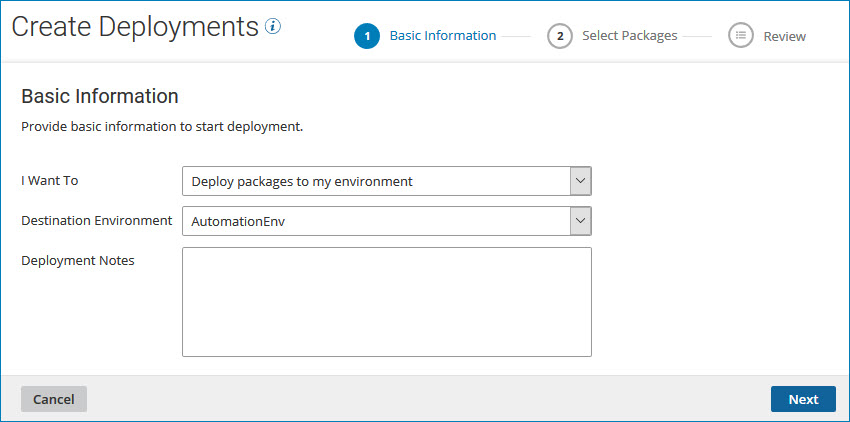
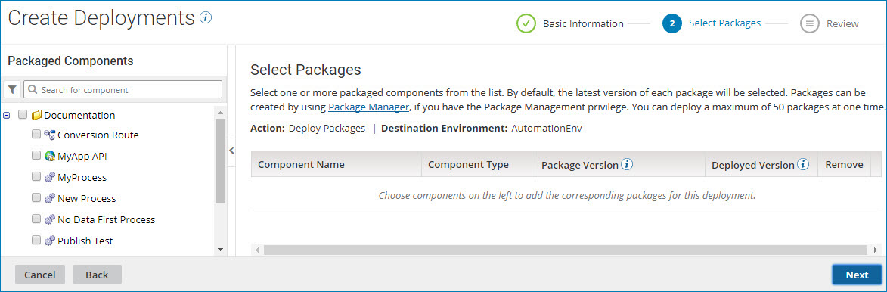
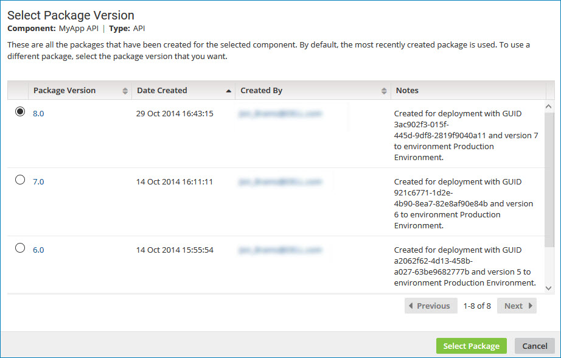
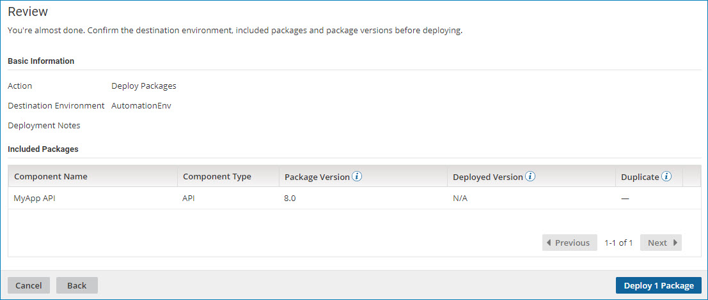

# Deploying packages from the Deployments page 

<head>
  <meta name="guidename" content="Integration"/>
  <meta name="context" content="GUID-ede7b995-bef5-43ef-92c9-6f82104b1a99"/>
</head>

From the **Deployments** page, deploy packages that were previously created but not yet deployed. You can deploy a maximum of 250 packages at one time.

## Before you begin

You must have the Process Deployment privilege to perform this task.

## About this task

Components must be packaged before they can be deployed. You can deploy a package that was previously created on the **Build** page or the **Package Manager** page.

## Procedure

1. From the **Deploy** menu, select **Deployments**.

    The Deployments page is displayed with a list of actively deployed packages.

2. Click **Deploy Packages**.

    The Create Deployments wizard opens to its Basic Information screen.

    

3. In the Basic Information screen, perform the following steps:

    1. In the **Destination Environment** drop-down list, select the environment where you want to deploy the package.

    2. In the **Deployment Notes** field, specify descriptive notes about this deployment.

    3. Click **Next**.

        The Select Packages page is displayed.

        

4. On the Select Packages page, perform the following steps:

    1. To search the list of packaged components, use the search box or filter icon  at the top of the **Packaged Components** list.

        For information about searching for packaged components, see the Search for packages to deploy topic.

    2. Select one or more components from the list of packaged components by turning on their check boxes.

        The packaged components that you select appear in the packages table. By default, the most recent version of each package is selected.

    3. To display information about a selected package, click **View details**.

        The Package Details page is displayed.

    4. To select a different version of a package, click **Select another version**.

        The Select Package Version page is displayed.

        

    5. Click the radio button for the version that you want to deploy, and click **Select Package**.

        The Select Packages page is redisplayed.

    6. To remove any packages that you do not want to deploy, do one of the following:

        - Clear the check box in the **Packaged Components** list.
        - Click **Remove ** to delete the row.

    7. Click **Next**.

        The Review screen is displayed.

        

5. Review your deployment information, then click one of the following:

    - **Deploy n Packages** to deploy the selected packages to the specified environment.
    - **Back** to return to the Select Packages page.
    - **Cancel** to cancel the request and return to the Deployments page.

    :::note
    
    If any of the package versions you selected are already deployed to the specified environment, you receive a warning message. The packages are identified with a value of Yes in the **Duplicate** column and they are not included in the number of packages to be deployed. When you click **Deploy n Packages**, the duplicate packages are not deployed.

    If all of the package versions you selected are already deployed to the specified environment, you receive an error message.

    :::

## Results

 If the specified environment was deleted or you no longer have permission to deploy to that environment upon clicking **Deploy n Packages**, the wizard closes and you receive an error message. You need to re-execute the wizard to deploy to another environment.
 