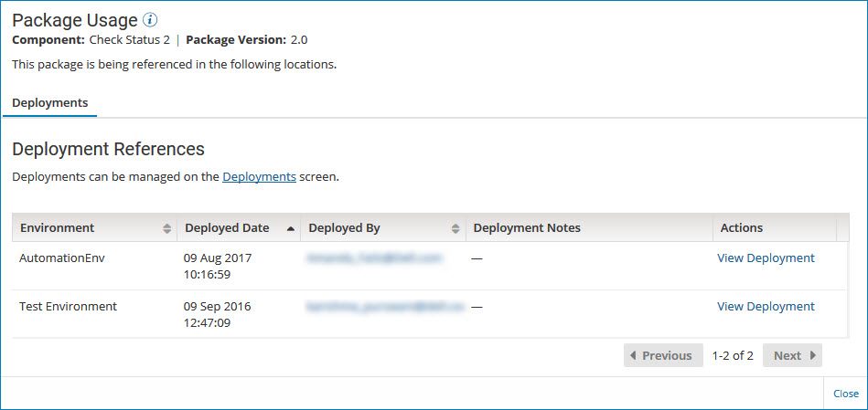

# Determining where a package is used 

<head>
  <meta name="guidename" content="Integration"/>
  <meta name="context" content="GUID-824ed253-42fb-4357-a769-b60275dbba1c"/>
</head>

On the **Package Manager** page, use the **Show Usage** action to determine if a package is being used and where it is being used — in deployments, in the Process Library, in integration packs, or in some combination of those.

## Procedure

1. On the **Package Manager** page, select a component from the components list.

    The Package History table is displayed.

2. Click the **Actions** icon  for a package version and select **Show Usage**.

    If the package version is being used in one or more locations, the Package Usage panel is displayed.

    

    The Package Usage panel provides detailed information about how and where a package is being used. The number of tabs that you see depends on the type of packaged component, how many places the package is being used, and your user privileges.

    **Deployments**  
    This tab identifies the environments where the package is deployed, when it was deployed, and by whom. You can view a specific deployment in the Deployments page or contact the user who deployed the package.

    Access to this tab requires the Process Deployment privilege and access to at least one of the environments where the package is deployed. The list of deployments that you see is limited by the environments to which you have access.

    **Process Library**  
    This tab identifies when the package was published to the Process Library and by whom. You can view the publication in the Process Library page or contact the user who published the package.

    Access to this tab requires the Process Library privilege.

    :::note
    
    The Process Library tab is displayed only for packaged processes. The tab is not displayed for any other type of packaged component because only processes can be published to the Process Library.

    :::

    **Integration Pack**  
    This tab lists the integration packs in which the package is included. You can view the contents of a specific integration pack in the Integration Packs page.

    Access to this tab requires the Integration Pack privilege.

    :::note
    
    If the package version is not in use, which means it has not been deployed, shared in the Process Library, or added to an integration pack, you receive a message when you click **Show Usage**.

    If the package is in use but you do not have the necessary user privilege or environment access to see any of the places where it is being used, you receive a warning message.

    :::

3. To return to the Package History table, click **Close** \(or click outside the Package Usage panel\).
