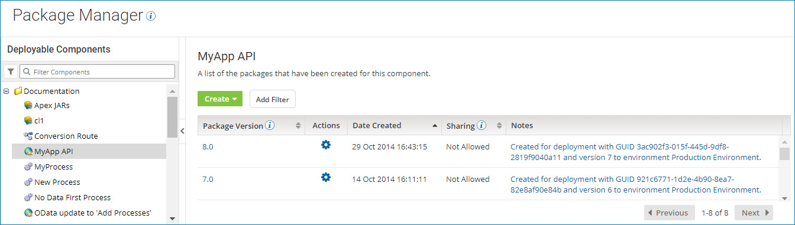

# Displaying a component's package history 

<head>
  <meta name="guidename" content="Integration"/>
  <meta name="context" content="GUID-55438c7a-a4c4-4680-b8a8-04f0346159f9"/>
</head>

The Package History table displays a list of all the packages that have been created for a given component. While reviewing the list, you can perform various actions such as comparing two package versions, copying a package to the Component Explorer, or determining where a package is used.

## Procedure

1. On the **Package Manager** page, select a component from the components list.

    The Package History table is displayed.

    

    By default, the packages are sorted by the date created in descending order. You can also sort the list by package version or whether or not the package can be shared.

    :::note
    
    The **Sharing** field appears only for processes and API Service components. Other types of deployable components \(such as certificates and custom libraries\) can be deployed, but they cannot be shared in the Process Library or added to integration packs.

    :::

2. To filter the list of packages, perform the following steps:

    1. Click **Add Filter**.

    2. Select one of the following filters:

        - **Package Version** - Specify a package version.
        - **Sharing** - Select **Allowed** for packages that can be shared, or **Not Allowed** for packages that cannot be shared.

    3. Click **Apply**.

        The packages that match the filter you selected appear in the list. The filter that is in effect is displayed at the top of the table.

        

    4. To apply additional filters, click **Add Filter** again and select another filter.

3. To reset the list, clear one filter at a time  or all filters .

4. To display detailed information about a package, click the version ID in the **Package Version** field.

## Results

The Package Details page is displayed.
