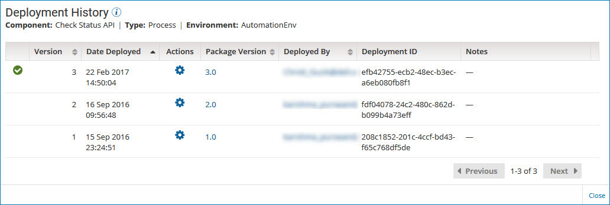

# Displaying a package's deployment history 

<head>
  <meta name="guidename" content="Integration"/>
  <meta name="context" content="GUID-7f9d5c59-d475-42cf-b4e1-338c3049aba7"/>
</head>

The Deployment History table displays a list of all the deployments for a given package. While reviewing the deployment history, you can display detailed information about a deployed package and compare the contents of two deployments.

## Procedure

1. On the **Deployments** page, select the package whose deployment history you want to review.

2. In the ** Actions** menu for the package, select **View Deployment History**.

    The Deployment History table is displayed.

    

    A green check mark identifies the package version that is actively deployed.

    By default, the deployments are sorted by deployment date in descending order. You can also sort the list by:

    - Deployment version
    - Package version
    - The user who deployed the package

3. To display detailed information about a package version, click the version ID in the **Package Version** field.

    The Package Details page is displayed.

4. To compare the contents of two deployments, click the **Actions** icon  for the deployment that you want to compare and select **Compare Deployment**.

    The Compare Deployment dialog is displayed.

5. To contact the user who deployed a specific package version, click the email address in the **Deployed By** field.

    Your email application opens with the user's name in the **To** field of a new message.

6. To close the Deployment History panel, click **Close** or click outside the panel.
