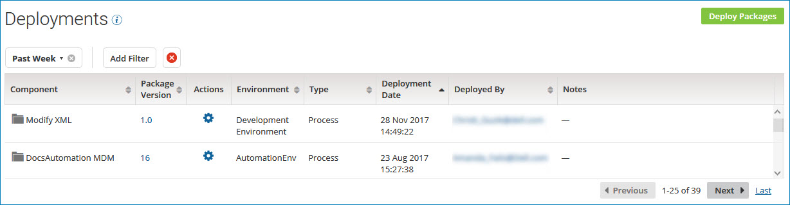

# Displaying actively deployed packages 

<head>
  <meta name="guidename" content="Integration"/>
  <meta name="context" content="GUID-a12c83a4-fd35-469b-88b6-a2a03a221c1b"/>
</head>

On the **Deployments** page, display a list of packages that are actively deployed, including all types of components in all environments to which you have access.

While reviewing the list of deployments, you can perform various actions such as viewing a package's deployment history, comparing deployed packages, or undeploying a package.

## Procedure

1. In the **Deploy** menu, select **Deployments**.

    The Deployments page is displayed.

    

    By default, the deployments are sorted by deployment date in descending order. You can also sort the list by:

    - Component name
    - Package version
    - Deployment environment
    - Component type
    - The user who deployed the package

    A date filter of **Past Week** is applied by default. You can change the date filter or clear it.

2. To filter the list of deployments, perform the following steps:

    1. Click **Add Filter**.

    2. Select one of the following filters:

        - **Component** - Select one or more components from the list of deployed components.

        - **Component Type** - Select one or more component types from the list of deployable component types.

        - **Deployed By** - Type all or part of a user name.

        - **Environment** - Select one or more environments from the list of environments available in your account.

        - **Package Version** - Specify a package version.

    3. Click **Apply**.

        The deployments that match the filter you selected appear in the list. The filter that is in effect is displayed at the top of the table.

        

    4. To apply additional filters, click **Add Filter** again and select another filter.

3. To reset the list, clear one filter at a time  or all filters .

4. To display detailed information about a deployed package, click the version ID in the **Package Version** field.

    The Package Details page is displayed.

5. To contact the user who deployed a package, click the email address in the **Deployed By** field.

    Your email application opens with the user's name in the **To** field of a new message.
    