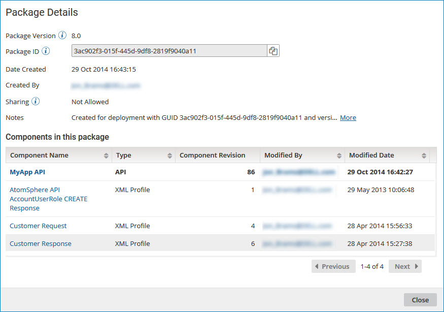

# Displaying package details 

<head>
  <meta name="guidename" content="Integration"/>
  <meta name="context" content="GUID-42deef40-9e54-407c-a568-42cfbd0da426"/>
</head>

Use the Package Details page to view detailed information about a specific package version.

## About this task

While reviewing these details, you can open any of the individual components in the **Build** page.

## Procedure

1. On the **Package Manager** page, select a component in the Component Explorer.

    The Package History table is displayed.

2. In the **Package Version** field, click the version ID for the package whose details you want to display.

    The Package Details page is displayed.

    

    :::note 
    
    The Package Details page is also available when you click a package version in the Deployments page, the Deployment History panel, and the Create Deployments wizard.

    :::

    For processes, API Service components, and Processing Group components, a package consists of the primary component and all the dependent components that are required to support that component \(such as subprocesses, connectors, or maps\). For other deployable components \(such as certificates and API Proxy components\), a package is the component itself.

    By default, the primary component is listed first, followed by any dependent components. You can also sort the list of components that make up the package by:

    - Component type
    - User who last modified the component
    - Date and time at which the component was last modified

3. To open a specific component within the package, click the name in the **Component Name** field.

    The Build page opens in a separate browser tab or window with the selected component displayed.

4. To contact the user who last modified a specific component within the package, click the email address in the **Modified By** field.

    Your email application opens with the user's name in the **To** field of a new message.

5. When you are done reviewing the package details, click **Close**.
