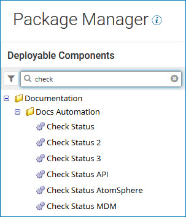

# Searching for components to package by name 

<head>
  <meta name="guidename" content="Integration"/>
  <meta name="context" content="GUID-748c1db2-be95-4448-8aa9-3f4d573363d2"/>
</head>

Use the search field in the Package Manager component list to find the components that you want to package.

## Procedure

1. On the **Package Manager** page in the search box at the top of the components list, type all or part of a component name.

    The components whose names contain the characters that you typed appear in the list.

    

2. To reset the list, do one of the following:

    - Click the **Clear** icon.
    - Press the **Esc** key.

## Results

After you have located the component, you can package it in preparation for deployment.
