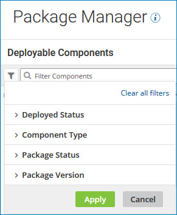

# Searching for components to package by using a filter 

<head>
  <meta name="guidename" content="Integration"/>
  <meta name="context" content="GUID-b4d6ce95-3d14-48eb-bec7-a620a9cc7ab8"/>
</head>

Filter the Package Manager components list to find the components that you want to package.

## Procedure

1. On the **Package Manager** page at the top of the components list, click the filter icon .

    The filter dialog opens.

    

2. Select one or more of the following filters:

    - **Deployed Status** - Search for components that are actively deployed (**Deployed**) or those that are not deployed \(**Not Deployed**\).

       :::note
       
       You must have the Process Deployment privilege to use this filter.

       :::

    - **Component Type** - Search for components by selecting one or more component types from the list.

      The following types of components can be packaged for deployment: Process, API, Certificate \(public X.509\), Process Route, Trading Partner, Custom Library, Flow Service.

    - **Package Status** - Search for components that have been previously packaged \(**Have Packages**\) or those that have never been packaged \(**Do Not Have Packages**\).

    - **Package Version** - Search for components by package version.

      The value that you specify must be an exact match for a component's package version.

   You can select any combination of filters. A component must match all selected filters to be included in the list.

3. Click **Apply**.

   The components that match the combination of filters you selected appear in the list.

4. To select different filters, click the filter icon, change your selections, and click **Apply**.

5. To reset the list, click the filter icon and click **Clear all filters**.

## Results

After you have located the component, you can package it in preparation for deployment.
