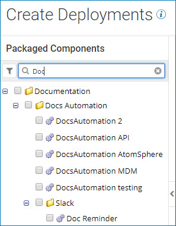

# Searching for packages to deploy by name 

<head>
  <meta name="guidename" content="Integration"/>
  <meta name="context" content="GUID-fcf0dfdd-84c3-4c91-913f-3ba22b6c1c3b"/>
</head>

Use the search field in the Create Deployments wizard to find packaged components that are available for deployment.

## Procedure

1. On the **Select Packages** page in the search box at the top of the packages list, type all or part of a package name.

    The packages whose names contain the characters that you typed appear in the list.

    

2. To reset the list, do one of the following:

    - Click the **Clear** icon.
    - Press the **Esc** key.
    