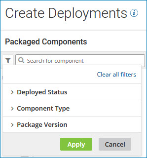

# Searching for packages to deploy by using a filter 

<head>
  <meta name="guidename" content="Integration"/>
  <meta name="context" content="GUID-0a875089-6dda-4c6d-92a2-65f383232aee"/>
</head>

Filter the packages list on the Select Packages page to find the packages that you want to deploy.

## Procedure

1. On the **Select Packages** page at the top of the packages list, click the filter icon .

    The filter dialog opens.

    

2. Select one or more of the following filters:

    - **Deployed Status** - Search for packages that are actively deployed \(**Deployed**\) or those that are not deployed \(**Not Deployed**\).

    - **Component Type** - Search for packages by selecting one or more component types from the list.

      The following types of components can be deployed independently: Process, API, Certificate \(public X.509\), Process Route, Trading Partner, Custom Library, Flow Service.

    - **Package Version** - Search for packages by version.

      The value that you specify must be an exact match for a package's version.

    You can select any combination of filters. A package must match all selected filters to be included in the list.

3. Click **Apply**.

    The packages that match the combination of filters you selected appear in the list.

4. To select different filters, click the filter icon, change your selections, and click **Apply**.

5. To reset the list, click the filter icon and click **Clear all filters**.
