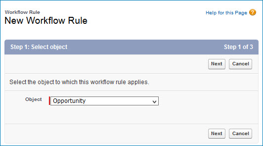
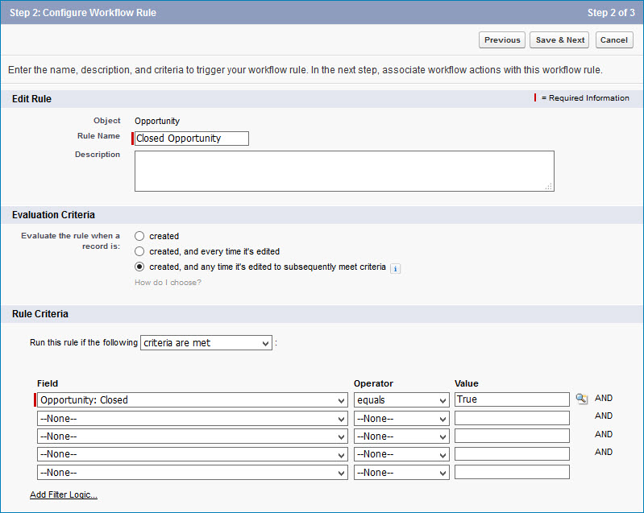
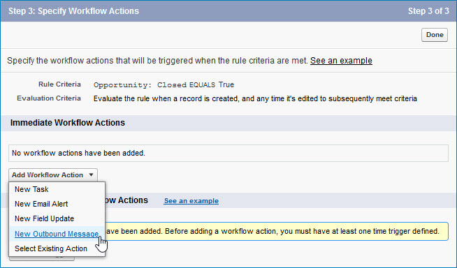
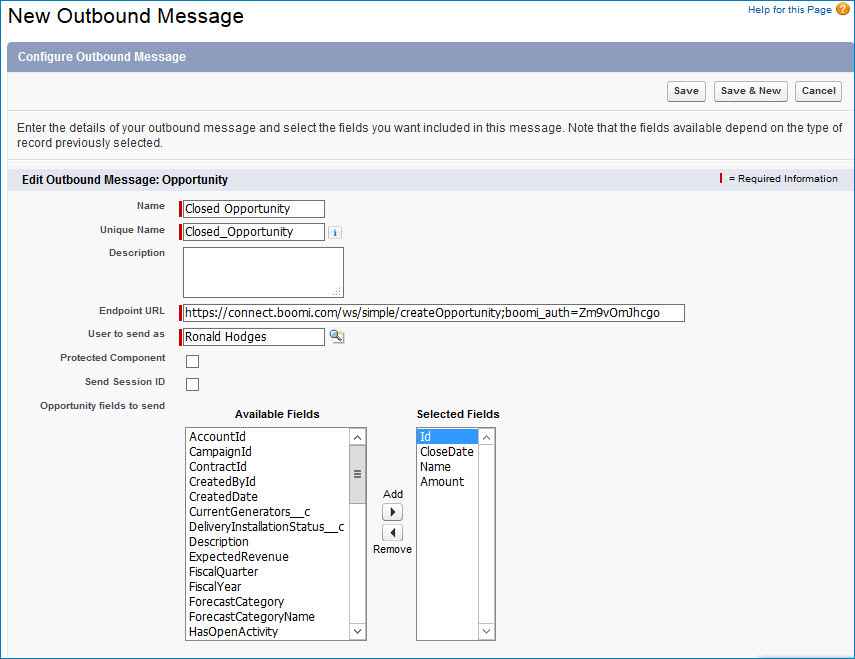

# Salesforce outbound messaging setup

<head>
  <meta name="guidename" content="Integration"/>
  <meta name="context" content="GUID-5a3e4330-c3d8-4200-91e1-c9ea8b1fd62c"/>
</head>

Within Salesforce, use Workflow Rules to set up outbound messages to Integration.

Following are the high-level steps for outbound messaging setup in Salesforce. Consult the [Salesforce help documentation](http://www.salesforce.com/us/developer/docs/api/Content/sforce_api_om_outboundmessaging_setting_up.htm) for detailed reference information.

1.  Select **Setup** \> **Create** \> **Workflow & Approvals** \> **Workflow Rules**.

2.  Configure a workflow rule for triggering the outbound message.

    1.  Click **New Rule**.

    2.  Select the Object.

        

    3.  Set the Rule Name and, optionally, the Description.

    4.  Select the Evaluation Criteria.

    5.  Select the Rule Criteria, which can be based on the modification of fields in Salesforce.

        

    6.  Select New Outbound Message as the Workflow Action.

        

3.  Define the outbound message.

    1.  Set the Message Name.

    2.  Select the Fields to Send.

    3.  Set the Endpoint URL, which must include the `boomi_auth` URL parameter. For more information and examples, see the topic API security, linked below.

        

If the outbound message will have multiple triggering workflow rules, you can then configure the additional workflow rules and select the outbound message as the Workflow Action for each.
