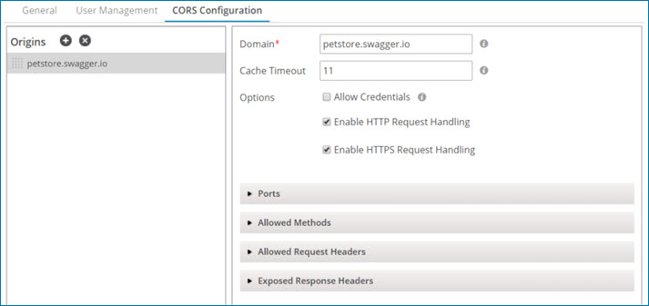

# Configuring the Shared Web Server to handle CORS requests

<head>
  <meta name="guidename" content="Integration"/>
  <meta name="context" content="GUID-d7bfe44e-0eb0-487c-9ab0-cb6c69120bcc"/>
</head>

Configure CORS request handling on the Shared Web Server panel within Atom Management.

## Before you begin

You must have the Atom Management privilege to perform this task. If you have the Atom Management Read Access privilege, you cannot perform the task.

**Note:** The CORS Configuration tab of the Shared Web Server panel is present only if **API Type** is set to Advanced on the General tab.

## Procedure

1.  Go to **Manage** \> **Atom Management**.

2.  Select the Atom, Molecule, or Atom Cloud from the list on the left.

3.  In Settings & Configuration, click **Shared Web Server**.

    The Shared Web Server panel opens. The number of tabs that you see and the settings on the tabs vary depending on whether the account you are using owns the Atom, Molecule, or Atom Cloud that you selected and the features enabled in the account.

4.  Select the **CORS Configuration** tab.

    

5.  In the Origins panel, click ** Add Origin**.

    The **Domain** field to the right populates.

6.  Do one of the following:

    -   To configure rules for handling incoming CORS requests originating from a specific domain, in the **Domain** field, replace “domain” with the name of the domain. You can use \* as a wildcard — for example, \*.mydomain.com.

        :::note
        
        Rules are applied according to their order in the list, so you should order origins from most specific to least specific. You can reorder origins by dragging their reorder icons ****. If you specify the origin \* \(any domain\), it should be last in the list.

        :::

    -   To configure rules for handling incoming CORS requests originating from any domain, in the **Domain** field, replace “domain” with \*.

7. **Optional:** If in the previous step you specified an individual origin domain, to allow authentication credentials with normal requests originating from this origin, select **Allow Credentials**.

8. **Optional:** Do one of the following:

    -   To allow requesting browsers to cache CORS metadata, set **Cache Timeout** to the number of seconds you want to allow caching.

    -   To prevent requesting browsers from caching CORS metadata, set **Cache Timeout** to 0.

9.  Do one *or both* of the following:

    -   To enable handling of HTTP requests from this origin, select **HTTP**.

    -   To enable handling of HTTPS requests from this origin, select **HTTPS**.

10. **Optional:** To specify the ports from which the web server allows requests from this origin:

    1.  Expand **Ports**.

    2.  In the **Port** field, type the port number.

    3.  Click ** Add Port**.

        The specified port is added to the ports list below.

    4. **Optional:** For each additional port you want to specify, repeat steps a–c.

    :::note
    
    If you skip this step, requests from the default ports are allowed — 80 for HTTP and 443 for HTTPS.

    :::

11. Specify allowed HTTP methods for requests from this origin:

    1.  Expand **Allowed Methods**.

    2.  In the **Method** field, type the name of the method — for example, GET.

    3.  Click ** Add Method**.

        The specified method is added to the allowed methods list below.

    4.  For each additional method you want to allow, repeat steps a–c.

12. **Optional:** To specify allowed headers, in addition to the defaults, for requests from this origin:

    1.  Expand **Allowed Request Headers**.

    2.  In the **Request Header** field, type the header name.

    3.  Click ** Add Request Header**.

        The specified header is added to the allowed request headers list below.

    4.  For each additional request header you want to allow, repeat steps a–c.

13. **Optional:** To specify headers, in addition to the defaults, included in the web server’s responses to requests from this origin:

    1.  Expand **Exposed Response Headers**.

    2.  In the **Response Header** field, type the header name.

    3.  Click ** Add Response Header**.

        The specified header is added to the exposed response headers list below.

    4.  For each additional response header you want to expose, repeat steps a–c.

14. For each additional origin from which you want the web server to handle requests, repeat steps 7–13.

15. Click **Save** to apply the settings on all of the Shared Web Server panel tabs.

    :::note
    
    A "Plugin Restart" message appears when Cloud owners save configuration changes on the Shared Web Server panel. Restarting the plugin saves changes to configuration settings, but may cause Shared Web Server downtime for users. Owners may choose to cancel the restart if they do not want to cause downtime for users, or if they want to restart the plugin at a later time.

    :::
