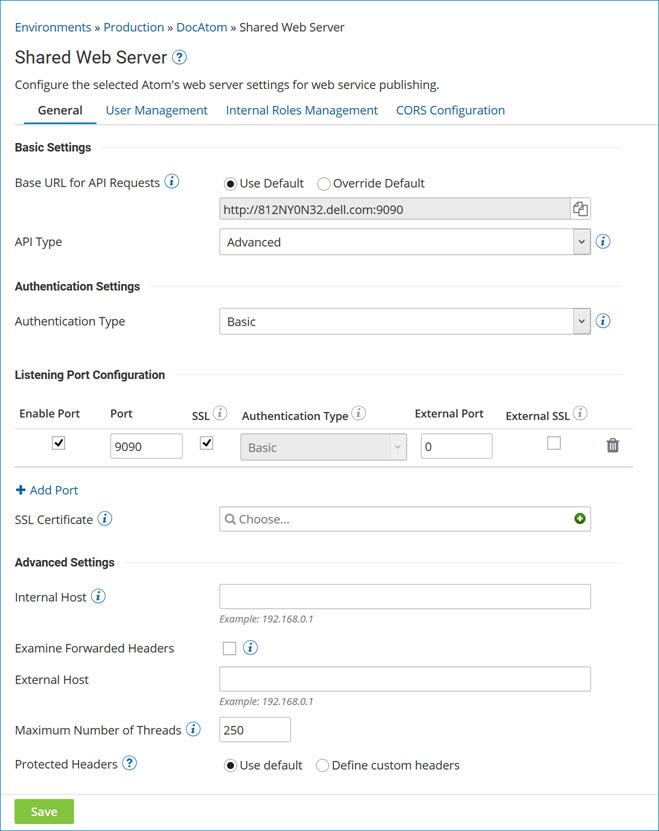

# Configuring access rights and IP filtering for the Shared Web Server 

<head>
  <meta name="guidename" content="Integration"/>
  <meta name="context" content="GUID-747b3629-bfe0-4caa-b9df-012a4e09372f"/>
</head>

Configure access rights on the Shared Web Server panel in Atom Management.

## Before you begin

You must have the Atom Management privilege to perform this task. If you have the Atom Management Read Access privilege, you cannot perform the task.

## About this task

If the account that you are using owns the Atom, Molecule or Atom Cloud that you selected, you can change the web server settings for it. You can change the settings either for the account or for web service users of the account. You can add and delete account users.

## Procedure

1.  Go to **Manage** \> **Atom Management**.

2.  Select the Atom, Molecule, or Cloud from the list on the left.

3.  Under Settings & Configuration, click **Shared Web Server**.

    The Shared Web Server panel opens. The number of tabs that you see and the settings on the tabs vary, depending on whether the account that you are using owns the Atom, Molecule, or Cloud that you selected and the features enabled in the account.

    

4. **Optional:** In the **Listening Port Configuration** section, choose an **Authentication Type** type: **None**, **Basic**, **Client Certificate Header**, **Client Certificate**, **Custom**, **Gateway**, or **External Provider**.

    The Custom authentication type is available only for Atoms and Molecules. It can be used only by accounts for which the API Management feature is enabled.

    If you are setting up an account and one or more web service users, they must all use the same authentication type.

    For Atoms and Molecules, the authentication type selected here will be used by all ports added to this web services server. For Clouds, each port that is added can use the None, Basic, or Client Certificate authentication types. The Cloud owner’s account can then select any one of the authentication types used by its ports as the Cloud’s authentication type.

    If you selected None, Basic, or Client Certificate, and **API Type** is set to Intermediate or Advanced, skip to step 10.

5.  If the **API Type** and **Authentication Type** are both set to Basic, do the following:

    1.  Click **Generate**.

    2.  If you want to show the token that was generated, select **Show Token**.

    3.  Skip to the last step.

6.  If the **Authentication Type** is set to Custom, do the following:

    1.  Type a **Login Module Class Name**.

    2. **Optional:** Select **Cache Authentication Credentials**.

    3. **Optional:**  Change the **Authentication Caching Timeout**.

    4.  Click **Add Option**.

    5.  Type a **Key**.

    6.   **Optional:** If you must encrypt a key-value pair that contains a private credential, select **Encrypt**, click **Click to Set**, enter the value, and click **OK**

    7. **Optional:**  Type a **Value**.

    8.  Repeat substeps d-g to add and define each option required by the login module.

7.  If **Authentication Type** is set to Client Certificate Header, specify a **Client Certificate Header Name**.

8.  If **Authentication Type** is set to Client Certificate Header or Client Certificate, choose a public certificate for the **SSL Certificate**.

9. **Optional:** Make other changes as needed to the settings on the General tab.

10. If the **User Management** tab is present, select it. Otherwise, skip to the last step.

11. In the **Users** list, make sure the account is selected.

12. If **API Type** is set to Intermediate or Advanced and the **Authentication Type** is set to Basic, go to the **Token** section and do the following:

    1.  Click **Generate**.

    2.  If you want to show the token that was generated, select **Show Token**.

13. If **Authentication Type** is set to Custom, select an API user, go to the **External Username** section and enter the external identity provider’s user name for that person.

14. If you want to use IP filtering, go to the **IP Filter** section and do the following:

    1.  Select **Use IP Filtering**.

    2.  Click **Add Filter**.

    3.  Type an IP address is the box above the **Add Filter** button.

    4.  Repeat the two steps above as needed to add more IP addresses. To delete an IP address, click the **Delete** link to the right of it.

15. If **API Type** is set to Intermediate and you want to allow access to only certain processes, go to the **Use Process Filtering** section and do the following:

    1.  Select **Allow access only for specified processes**.

    2.  Select the check boxes next to the processes to which the selected account \(or API user\) should have access.

16. If **API Type** is set to Advanced and you want to allow access to processes linked only to certain API Service components, go to the **API Filtering** section and do the following:

    1.  Select **Allow access only for specified APIs**.

    2.  Select the check boxes next to the API Service components whose linked processes should be accessible to the selected account \(or API user\).

17. In the **Users** list, click the  **Add User** icon.

18. In the **Username** section, type an API user name.

19. Click **Save** to apply the settings on all of the Shared Web Server panel tabs.

    You are prompted to restart the Atom, Molecule, or Atom Cloud. You have the option to restart now or restart later.