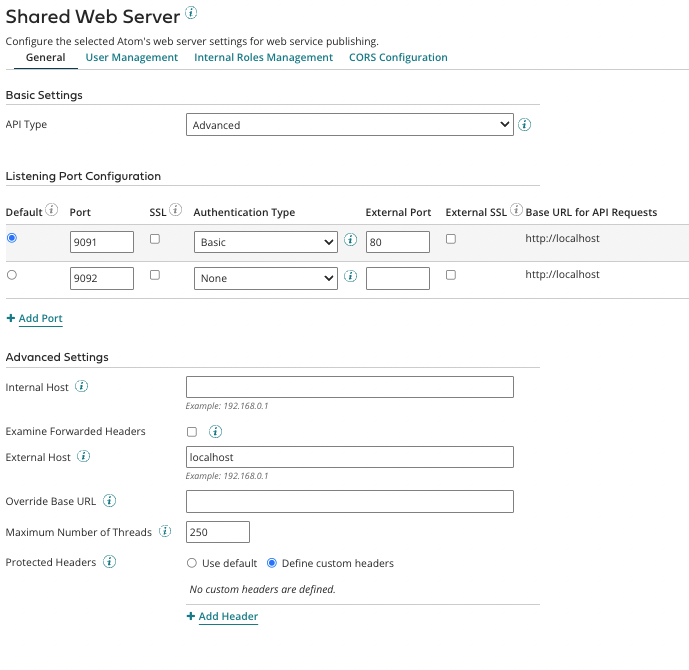

# Multi-Mode Authentication

<head>
  <meta name="guidename" content="Integration"/>
  <meta name="context" content="GUID-a100ab5f-1859-4abe-a560-b0438796158a"/>
</head>

Multi-mode authentication support is available in the Shared Web Server. This feature allows for multiple authentication methods for Atoms and Molecules, with the ability to specify an authentication method for a specific port. You can also configure multiple credentials for your users if you have multiple authentication methods configured.

For Atom Clouds and Cloud attachments, the Shared Web Server configuration is detailed at [Shared Web Server panel](r-atm-Shared_Web_Server_panel_135fde50-19db-488d-bb5c-b9ef43456e75.md).

:::note

With this feature, Atom security is tightened. The Atom will only authenticate users with a given authentication method if that method has been configured for the Atom/attachment. Cloud owners should take care if you change the authentication method on a configured listener. Currently, the accounts that have attachments to this cloud are not notified if the listener authentication method has changed. This creates a situation where the attachment has a different authentication method configured than what the listener on the cloud allows and requests to this attachment will fail.

:::

## Configuration

| Field                     | Description |
|---------------------------|-------------|
| **Basic Settings**        |             |
| API Type                  | <ul><li>Basic - User management is disabled. Client certificates and Custom authentication cannot be used. API Service/Proxy components cannot be used.</li><li>Intermediate - User management is enabled at the individual process level. API Service/Proxy components cannot be used.</li><li>Advanced- API Service/Proxy components are enabled. User management is enabled at the API Service component level. This is the default for new accounts for which the API Management feature is enabled.</li></ul> |
| **Listening Port Configuration** |   |
| Default                    | The default port is used for accessing Swagger in a deployed API. It is also used to construct PublishedApi objects returned by AtomSphere Developer APIs. |
| Port                       | The port number of the external port which routes to the shared web server listener. |
| SSL                        | If selected, the port is an SSL \(HTTPS\) port. The default for SSL ports is 9093. |
| Authentication Type        | The ports' authentication type is the same as the accounts authentication type. The authentication type can be changed for the account or for individual ports in the account. The options are None, Basic, Client Certificate, Client Certificate Header, Custom, External Provider, Gateway.  **Note**: Only one **Listening Port** can be configured with **Gateway** authentication. |
| **External Port**          |             |
| External Port              | The Port number of the load balancer that routes requests to the Shared Web Server port. It defaults to 443 if External SSL is selected. Used to construct the **Base URL for API Requests**. |
| External SSL               | If selected, the external port is an SSL \(HTTPS\) port. The default **External Port** is 443 if this field is selected. External SSL ports can be redirected to an internal non-SSL port. |
| Base URL for API Requests  | This URL is constructed per the configured **External Host** and optionally the **External Port**. If an **External Port** is not specified, the default Host name is used. |
| SSL Certificate            | If the **Authentication Type** is set to **Client Certificate**, the SSL Certificate field displays. Select the correct Certificate component for the client. |
| **Advanced Settings**      |             |
| Internal Host              | For multi-homed boxes, an IP address for binding to a specific interface. |
| Examine Forwarded Headers  | Selecting this option substitutes the load balancer’s host name for the node’s host name in the request. For more information refer to [Shared Web Server panel](r-atm-Shared_Web_Server_panel_135fde50-19db-488d-bb5c-b9ef43456e75.md). |
| External Host              | The external host name or IP for the listener. This field is mandatory if **External SSL** is selected. |
| Override Base URL          | This value is used for information only in API URLs that are displayed in API Management to access APIs or their related documentation. It does not affect an Atom’s connectivity. |
| Maximum Number of Threads  | The maximum number of handler threads that the listen process spawns. Other requests are queued. The default is 250. |
| Protected Headers          | See [Protected Headers](r-atm-Shared_Web_Server_panel_135fde50-19db-488d-bb5c-b9ef43456e75.md#GUID-88B41CBE-3BEB-404B-9E2E-FFB0DF90CD86). |
