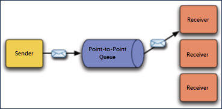
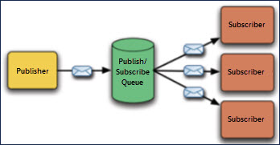

# Queue components

<head>
  <meta name="guidename" content="Integration"/>
  <meta name="context" content="GUID-082DA7EF-435A-4A88-B65A-1C251251AD56"/>
</head>

The Queue component specifies the configuration of a native Integration message queue. An Atom’s shared queue server creates a message queue upon invocation of a Boomi Atom Queue connector Get, Send or Listen action that specifies the Queue component.

:::note

Atom message queuing is an optional feature. To have this feature enabled in your account, contact your Boomi sales representative.

:::

## Settings tab

**Name**  
**Description**

**Queue Name**  
Name of the message queue. This can be different from the queue component name if desired.

**Queue Type**  
Messaging model with which the message queue is used:

 -   Point-to-Point — While any number of senders can send messages to a Point-to-Point message queue, each message sent is guaranteed to be delivered to one receiver. Point-to-Point message queues retain all messages sent to them until the messages are received or until the messages expire. Point-to-Point queues are durable.

     

 -   Publish/Subscribe — Publishers publish messages to a Publish/Subscribe message queue. Subscribers may register interest in receiving messages on the message queue, but neither the publisher nor the subscriber knows about each other. Zero or more subscribers receive each published message.

 

 The subscriber has to remain continuously active to receive messages, unless it has established a durable subscription. In that case, messages published while the subscriber is not connected are redistributed whenever it reconnects.

  -   Publish/Subscribe queues are always durable when used with the Listen action — the subscription is per-process.

  -   Publish/Subscribe queues are always non-durable when used with the Get action.