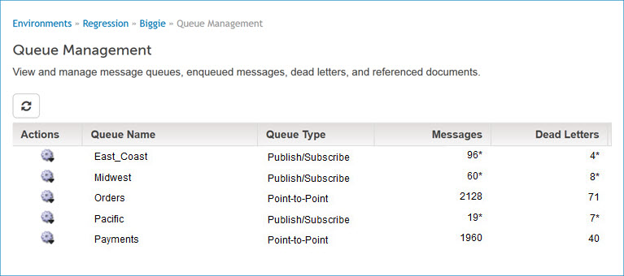

# Queue Management panel

<head>
  <meta name="guidename" content="Integration"/>
  <meta name="context" content="GUID-DF059CE0-2D61-4D41-8DC6-8DF7E5001520"/>
</head>

The Queue Management panel appears on the Atom Management page \(**Manage** \> **Atom Management**\) when you have queue management configured on your Boomi account. This panel is used to manage message queues, enqueued messages, dead letters, or referenced documents.

:::note

You must have the Atom Management privilege to perform most of the actions on the Queue Management panel. If you have the Atom Management Read Access privilege, you can view queues, messages, dead letters, and document details, but you cannot make any modifications.

:::

On this panel, clicking **** refreshes the currently displayed list.

-   If a message queue list is displayed it is one of the following types:

    -   Queue Overview — list of all of the Atom shared message queue server’s Point-to-Point and Publish/Subscribe queues. This list appears on the tab by default.

    -   Subscribers — list of a Publish/Subscribe queue’s subscriber message queues. This type of list appears when ** Manage Subscriber Queues** is selected in the ** Actions** menu for a Publish/Subscribe queue in the Queue Overview list. The list heading shows the name of the Publish/Subscribe queue. Clicking **Back to All Queues** restores the Queue Overview list.

    For each message queue in a message queue list, the following tools are available and properties are shown:

    ** Actions**  
    This menu has the following selection for all message queues regardless of type:

    -   ** Delete this Queue** — Initiates a request to delete the queue.

      In the confirmation dialog:

      -   Clicking **OK** executes the operation.

       -   Clicking **Close** cancels the operation.

     This menu has the following additional selections for Point-to-Point and subscriber message queues:

     -   ** View Messages** — Loads the queue’s Messages list. If there are not any messages in the queue, this selection is not available.

     -   ** View Dead Letters** — Loads the queue’s Dead Letters list. If the queue does not have dead letters, this selection is not available.

     -   ** Clear Messages** — Initiates a request to clear the queue by removing all of its messages.

            In the confirmation dialog:

            -   Clicking **OK** executes the operation.

            -   Clicking **Close** cancels the operation.

            If there are not any messages in the queue, this selection is not available.

     -   ** Clear Dead Letters** — Initiates a request to clear the queue’s dead letters.

            In the confirmation dialog:

     -   Clicking **OK** executes the operation.

     -   Clicking **Cancel** cancels the operation.

    If the queue does not have dead letters, this selection is not available.

    This menu has the following additional selection for Publish/Subscribe queues:

    -   ** Manage Subscriber Queues** — Loads the Subscribers message queue list.

    **Queue Name**  
    \(Queue Overview list only\) Name of the message queue.

    **ubscriber Name**  
    \(Subscribers message queue list only\) Name of the subscribing process.

    **ueue Type**  
    \(Queue Overview list only\) Type of the message queue — Point-to-Point or Publish/Subscribe.

    **Messages**  
      -   Point-to-Point or subscriber queue — count of messages in the message queue.

      -   Publish/Subscribe queue — aggregate count of messages in the subscriber queues.

    **Dead Letters**  
      -   Point-to-Point or subscriber queue — count of the message queue’s dead letters.

      -   Publish/Subscribe queue — aggregate count of the subscriber queues’ dead  letters.

-   If a message list is displayed it is one of the following types:

    -   Messages — list of a Point-to-Point or subscriber message queue’s currently enqueued messages. This type of list appears when ** View Messages** is selected in the ** Actions** menu for a message queue in a message queue list.

        

    -   Dead Letter Queue — list of a Point-to-Point or subscriber message queue’s dead letters. This type of list appears when ** View Dead Letters** is selected in the ** Actions** menu for a message queue in a message queue list.

        

    The list heading contains the queue name and the type of list.

    The following action menus operate on all or selected messages \(or dead letters\) in a message list:

    **Name**  
    **Description**

    **Retry**  
    \(Dead letters only\)

    - Selected — Initiates a request to resend each selected dead letter to the message queue

      In the confirmation dialog:

    - Clicking **OK** executes the operation.

    - Clicking **Close** cancels the operation.

    - All in this Queue — Initiates a request to resend all dead letters to the message queue.

      In the confirmation dialog:

      - Clicking **OK** executes the operation.

      - Clicking **Close** cancels the operation.

    **Delete**  
    - Selected — Initiates a request to delete each selected message.

    In the confirmation dialog:

    - Clicking **OK** executes the operation.

    - Clicking **Close** cancels the operation.

    - All — Initiates a request to delete all messages.

      In the confirmation dialog:

      - Clicking **OK** executes the operation.

      - Clicking **Close** cancels the operation.

      For each message \(or dead letter\) in a message list, the following tools are available and properties are shown:

        **check box**  
        Selects the message for action \(**Retry** or **Delete**\).

        **ID**  
        System ID of the message.

        **Time Stamp**  
        Date and time at which the message arrived in the message \(or dead letter\) queue.

        **Number of Documents**  
        Count of referenced documents in the message. This is a link to the document list.

-   A document list contains an entry for each document referenced in an enqueued message or dead letter. The list heading contains the queue name and the system ID of the message or dead letter.

    

    For each listed document, the following tools are available and properties are shown:

    ** Actions**  
    This menu has the following selection:

    - ** View Document Details** — Opens the Document Viewer dialog, which shows document data \(up to 10 KB\) and enables you to download the document.

    **ID**  
    System ID.

    **Document Size \(kb\)**  
    Size, in KB.

    Clicking **Back to Messages** restores the message list.
