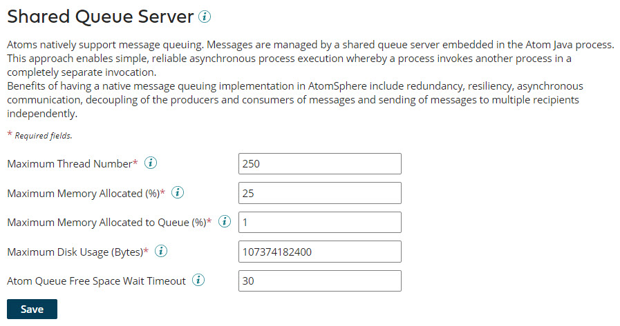

# Shared Queue Server panel

<head>
  <meta name="guidename" content="Integration"/>
  <meta name="context" content="GUID-3a906c55-eecc-4bdc-98e1-62cab1078643"/>
</head>

The Shared Queue Server panel appears on the Atom Management page \(**Manage** \> **Atom Management**\). This panel is used to configure the selected Atom’s message queue server settings.

:::note

You must have the Atom Management privilege to configure message queue server settings. If you have the Atom Management Read Access privilege, you can view the settings but you cannot change them.

:::

