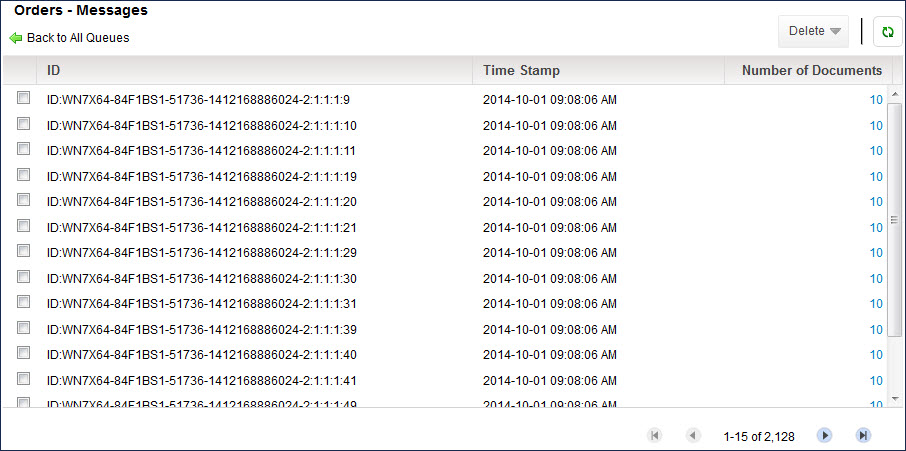
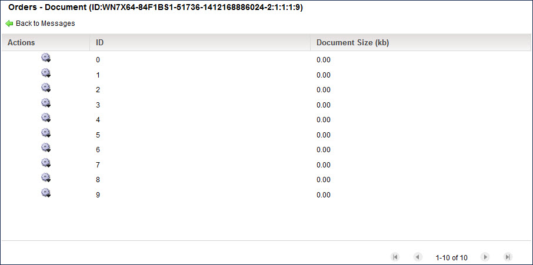

# Viewing the messages in a message queue 

<head>
  <meta name="guidename" content="Integration"/>
  <meta name="context" content="GUID-276b0a3a-f2ce-4b06-892e-3d4612a253fd"/>
</head>

View the message queue on the Queue Management panel of Atom Management.

## About this task

**Important:** Known issue: There is a known limitation which results in an inability to browse messages on a queue or dead letter queue past a certain number on the View Messages and View Dead Letters screens. This number varies between runtimes, and is based upon the available memory of the runtime. Unfortunately, there is no workaround for this issue.

## Procedure

1.  On the **Manage** menu select **Atom Management**.

2.  Select the Atom, Molecule, or Cloud from the list on the left.

3.  In Runtime click **Queue Management**.

    The Queue Management panel opens.

4.  If the message queue is a subscriber queue, in the ** Actions** menu for the applicable Publish/Subscribe queue, select ** Manage Subscriber Queues**.

5.  In the ** Actions** menu for the message queue, select ** View Messages**.

    The queue’s message list appears.

    

    **Note:** If memory limits prevent the full number of messages from being listed, a banner displays how many messages are able to be viewed.

6.  To view the list of documents referenced in an individual message, click its Number of Documents link.

    The message’s document list appears.

    

7.  To view an individual document’s data, in the ** Actions** menu for that document, select ** View Document Details**.

    The Document Viewer dialog opens. When you are done viewing the data. click **Close Document Viewer**.

8. **Optional:**  For each additional document whose data you want to view, repeat step 8.

9. **Optional:** For each additional message whose list of referenced documents you want to view, click **Back to Messages** and then repeat steps 7–9.