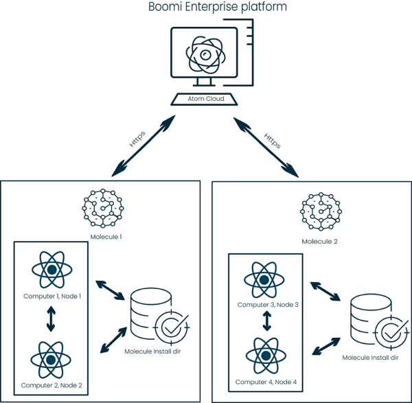

# Atom Clouds 

<head>
  <meta name="guidename" content="Integration"/>
  <meta name="context" content="GUID-b835095b-048e-4871-a42d-b2186707e314"/>
</head>

When referring to Atom Clouds, there are Boomi Atom Clouds and Test Atom Clouds in the Americas, Europe, and the Asia-Pacific, all of which are maintained and run by Boomi. You can deploy your cloud-based integration processes to any of these Atom Clouds to which your account has access. You can also set up *your own private* Atom Cloud.

An Atom Cloud is similar to a Molecule, with several exceptions:

- It is multi-tenant, whereas a Molecule is single-tenant. Multiple accounts can use an Atom Cloud.

- It uses forked execution, which allows each integration process to run in a separate Java virtual machine and is not enabled in a Molecule by default.

- It uses a High security policy, whereas Molecules use a Low security policy.

An Atom Cloud consists of one or more Cloud Molecules installed on multiple machines. The Cloud Molecules on the machines are grouped together to form the Atom Cloud. The Boomi Enterprise Platform assigns each account to a particular Cloud Molecule so that processing is spread across the available Cloud Molecules. This is automatic based on the number of assigned accounts to each Cloud Molecule. The Boomi Enterprise Platform attempts to maintain an even number of accounts.

## Why have a private Atom Cloud

If you would like to do any of the following, set up your own private Atom Cloud.

- Share your Molecule across multiple customer accounts — A typical scenario is that a Boomi partner sets up an Atom Cloud and shares it with their accounts.

- Run and store customer data within your own infrastructure — For security reasons, you might require this scenario because of contractual requirements between you and your accounts or to comply with regulations concerning data storage.

- Process very high volumes of data — To do this, you need to increase the amount of memory available per Molecule to more than the 512 MB allocated by default.

- Control all hardware resources.

- Provide your own public URL \(for example, connect.yourcompany.com\).

## Installing a private Atom Cloud

- For information about system requirements including hardware and software requirements, Java restrictions, IP ranges for network security and more, see the system requirements.

- See the instructions for adding an Atom Cloud and downloading the Cloud Molecule installer, installing an Atom Cloud on Windows and installing an Atom Cloud on Linux.

- If you plan to use a web server with your Atom Cloud, see topics about embedding a web server.

As the owner of an Atom Cloud, you can see all of its Cloud Molecules on the Process Reporting and Atom Management pages. They appear by the Atom Cloud name plus the Cloud Molecule name. For example, if you have an Atom Cloud named "MyCloud" that consists of two Cloud Molecules named "CM1" and "CM2", you see MyCloud\(CM1\) and MyCloud\(CM2\). However, your accounts see only the Cloud Molecule to which they are assigned.

You can add any number of Atom Clouds in your account. You can run only one Cloud Molecule per machine.

:::note

You can add Atom Clouds on the Cloud Management page. Also, you can find the Cloud Molecule installer on the Cloud Management page. To see this page, you must have the Cloud Management privilege and enable Atom Clouds in your account.

:::

## Production and test Atom Clouds

If you are using environments with test connections enabled in your account, you must select a classification when you add a private Atom Cloud: Production or Test. For example, you can attach production Atom Clouds to production environments only and attach Test Atom Clouds to test environments only. The production Atom Clouds run in a different physical environment from the test Atom Clouds. This configuration is a best practice that Boomi follows. Partners who want to install and manage their Atom Clouds must do the same. You can set the classification only when you add an Atom Cloud. You cannot change it later.

:::note

Atom Clouds added before the January 2014 release are production Atom Clouds, and you cannot change the classification because they are attached to production environments.

:::

The classification also determines which license to use when deploying a process to an environment attached to this Atom Cloud. For example, you must have test connection licenses to use a test Atom Cloud with test environments. See the topic about test connection licenses.

## Configuring and maintaining a private Atom Cloud

After installing an Atom Cloud, you might want to modify how it runs, change default settings, or even remove it. See the topic on Atom, Molecule, and Cloud management.

Atom Clouds use a High security policy. Custom connectors that run in an Atom Cloud have additional security restrictions.

## Deploying processes to a private Atom Cloud

When you deploy processes to a private Atom Cloud:

- If you install your own Atom Cloud, your scheduled processes run according to the system time of the machines on which you install the Cloud Molecules in your Atom Cloud.

- There is currently no limit to the number of processes you can deploy to a Cloud Molecule in an Atom Cloud.

- Only a certain number of processes can run simultaneously on a Cloud Molecule. If you schedule many processes to run simultaneously, they go into a queue. At peak processing times, your processes start no later than three \(3\) minutes after the originally scheduled time.

- The Boomi Atom Clouds' default character encoding is UTF-8, but you can configure your private Atom Cloud differently.

    The **File Encoding** property on the **Properties** panel controls the character set that the Atom uses to transform bytes to characters \(and characters to bytes\) if you do not provide an explicit character set. For more information, see [Supported Encodings](http://docs.oracle.com/javase/8/docs/technotes/guides/intl/encoding.doc.html) on the Oracle website.
    