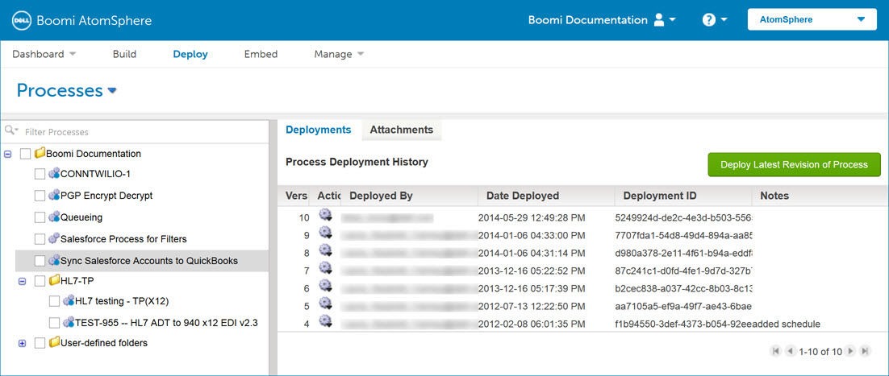

# Deploy page \(Legacy, non-environment\) 

<head>
  <meta name="guidename" content="Integration"/>
  <meta name="context" content="GUID-a46e0813-6355-427b-9d92-4390e9d9e898"/>
</head>

The Deploy page allows you to attach one or more Atoms to a specific process for strategic management and to deploy the latest revision of a process. A single process can be deployed to multiple Atoms and a single Atom can contain many deployed processes. If environments are enabled in your account, you can attach and deploy processes to a specific environment.

:::note

For Environment-enabled accounts, the [Deploy menu](c-atm-Deploy_menu_10d40903-a721-4630-bcac-769d1b87a9dd.md) provides access to an enhanced deployment workflow.

:::

New processes must be attached and deployed to an Atom or environment before you can execute them in production mode. You can use Test mode to run test executions while developing or troubleshooting a process.

On the Deploy page, you can view a process’ deployment history, redeploy a process version, compare deployments, and view details about deployed components.

If you work with a large number of processes, have child or common components that change frequently, or use processes that a partner updates and shares with clients, you might want to deploy or redeploy many processes at the same time.

:::note

The Deploy page also allows you to deploy these types of independently deployable components:

- APIs
- Certificates
- Custom libraries
- Flow services
- Integration packs
- Process routes
- Processing groups

:::
