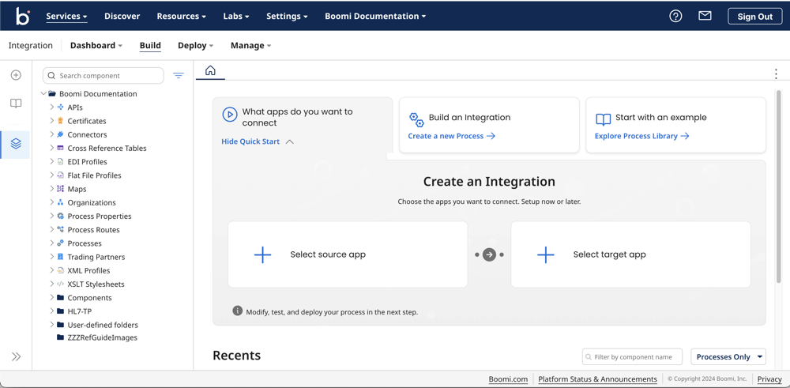

# Integration Workflow

<head>
  <meta name="guidename" content="Integration"/>
  <meta name="context" content="GUID-0ff5baa9-222d-4c9a-b97a-982cef8b6d9d"/>
</head>

The integration workflow consists of three main phases: Build, Manage, and Deploy. Each phase plays a crucial role in ensuring seamless data processing and communication between applications.

- **Build**: This phase involves designing and organizing data processes. Using an intuitive, visual designer, users can extract, manipulate, validate, and structure data to create workflows that integrate different applications without the need for coding.

- **Deploy**: In the Deploy phase, the created processes are packaged and deployed across different environments. It also includes installing integration packs shared within an account, enabling smooth execution of the integration processes.

- **Manage**: After deployment, the Manage phase provides a consolidated view of all integration activities. It allows users to monitor the status of deployed processes, view historical process results, and troubleshoot errors, ensuring the continuous and smooth operation of workflows.

These three phases—Build, Deploy, and Manage form the foundation of effective integration workflow management.

 Build menu 

Integration uses the Build concept to organize and control data processing. An integration service allows extraction, manipulation, validation, and forwarding of structured data types. Integration requires data structuring to enable communication between different applications. To integrate applications directly from the web without coding, Integration uses an intuitive visual designer for you to create and direct process flows easily.

Use the **Build** page to build processes and configure components that become the steps within your process. There are two parts to the **Build** page; the left side of the build page is called the Component Explorer, which is the folder hierarchy in which existing components reside. It also contains the Process Library, which is a catalog of templates that you can install and customize in your account.

The right side of the screen, known as the process canvas is where you create components and build processes using a drag-and-drop interface. You can enter full screen from the More Options menu () in the upper-right corner of the screen.

 Deploy menu 

The **Deploy** page provides access to all deployment-related activities in accounts where you enabled Environments. It includes packaging, deploying processes and components, and installing integration packs shared with an account.

When you click **Deploy** you can select one of the following, depending on your account and user privileges:

- Packaged Components — Lets you create and manage deployable packages for the processes and components that you build.

- Deployments — Lets you monitor existing deployments and create new deployments.

- Integration Packs — Let managed account users deploy or install shared integration packs.

 Manage menu 

The **Manage** menu provides a consolidated view of all integration activity within your account for deployed processes, including Atom and Cloud status and historical process run results. You can view processed data and troubleshoot errors.

Each time a process runs, the results and detailed logs are collected and appear on the Manage page.

From the **Manage** page you can select one of the following:

- Process Reporting
- Atom Management
- Cloud Management \(if enabled for your account\)
- Boomi Assure \(if enabled for your account\)
- Process Library \(if enabled for your account\)
- Integration Packs \(if enabled for your account\)
- Trading Partner Management \(if enabled for your account\)

### Component Explorer and Process Library

On the left side of the screen is a sidebar that, when expanded, has shortcut links to **Create New** integrations, browswe the **Process Library**, and the **Component Explorer**:

- The [Component Explorer](../Process%20building/c-atm-Component_Explorer_b293eeb3-9616-4aa0-ba2d-60cf2d1f37fd.md) lists all the components in the account grouped by type. You can create folders to organize your components. Click the More Options menu next to any folder or component to access different actions, like opening, copying, cloning, and deleting the component.

  :::tip
  
  The **Show Where Used** option shows you where a component is referenced in other folders or components.

  :::

- The **Process Library** link opens a dialog where you can browse and install your own copies of published processes. The [Process Library](../Integration%20management/c-atm-Process_libraries_8afa6002-d3a9-4e4d-93fb-1aada133ca31.md) includes processes published by or published to account groups where your account is a member. You can also open the Process Library by clicking the **Explore Process Library** link.
  
  After installation, you can configure and customize these processes to fit your needs. These processes are easy to use, cut down on build time, and offer to build solutions for common integration scenarios you may need.

### Recents section

The **Recents** section provides a quick way to open a recently saved or viewed item. Additionally, the **Build** page automatically reopens any processes or components that you opened but not yet closed before navigating away from the **Build** page. You can disable this feature from the **Preferences** page in the **Settings** \> **Account Information and Setup** menu.

### The Process Canvas

Use the **Build** page to create new processes and components. To do so, click **Create a new Process**.

When you create or open a process or component for editing, the [process canvas](../Process%20building/c-atm-Process_canvas_7092acce-da3a-4bf1-9130-ac2b74eebd22.md) opens. The **process canvas** is the drag-and-drop platform in which you define a sequence of steps to create an integration from start to finish. A new process always opens with a Start step.

On the process canvas, you can open the *steps palette* by clicking the Steps icon (). The *steps palatte* contains three groups of process steps:

- **Execute** — steps that manipulate or transform data as it passes through the process.

- **Logic** — steps that control the processing path of the data passing through the process.

- **Connect** — steps that get data into or send data out of the process using one of the application or technology connectors.

You can hide the *steps palatte* by clicking the Steps icon again.

