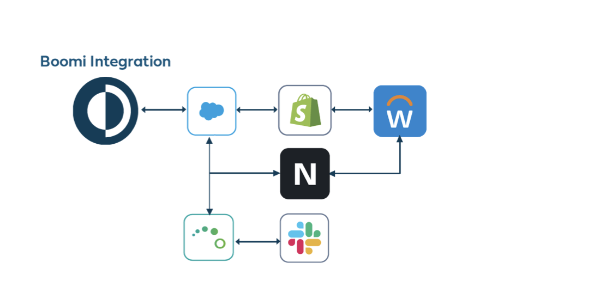
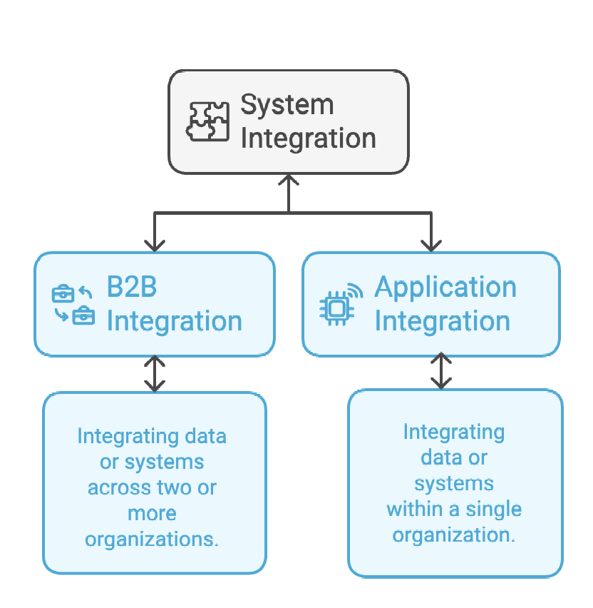

# Getting started with Integration

<head>
  <meta name="guidename" content="Integration"/>
  <meta name="context" content="GUID-257fcf2c-7e93-48d0-be67-bd53fb444930"/>
</head>

Integration is the combining of software and/or hardware components into an overall system. The Integration service provides tools and an intuitive and simple visual interface to intelligently connect and integrate your applications and data whether on premises or in the cloud. You also get access to pre-built integrations that let you jump-start and automate workflows across your distributed environments, including mobile, batch \(ELT\), and EDI environments.

## Integration Structure

There are two main types of system integration:

## Use Cases

- **B2B Integration example:**

  **Scenario:**

  Market Cedar Ice Creams submits an order to World of Flavors Manufacturing, which collaborates with Frozen Travel Distributors for order fulfillment.

  **Integration Benefit:**

  Instead of tracking order transactions manually, our integration service facilitates automatic data exchanges between all parties involved, providing seamless updates on order status and delivery estimates.

- **Application Integration example:**

  **Scenario:**

  Jane needs an invoice from Accounting involving a chain of requests from Ivy to Bella.

  **Integration Benefit:**

  With our Integration services, Jane can retrieve the needed information directly from the system without going through numerous manual steps.

## Tools and Features

Integration offers the following features and tools to accelerate your processes:

- **Intuitive Interface**: User-friendly visual tools for ease of use.

- **Data Mapping Tools**: Simplifies the mapping of data across applications.

- **Process Building Recipes**: Predefined templates to accelerate process building.

- **Library of Connectors**: A vast selection of connectors for diverse applications.

### Intelligent automation features

In order to help you create processes seamlessly, we offer intelligent automation for your processes which include: 

- **Recommended Connections**: Suggestions for optimal connections tailored to your needs.

- **Boomi Suggest**: AI-powered mappings that expedite the integration process.

- **Drag and Drop Capabilities**: Simplify the process-building experience.

- [**QuickStart**](https://www.youtube.com/watch?v=DXsOJaq4DhE&list=PL4f0Zwq9gwOnVGa-GiSRQvt1omL0uUGpM&index=7) **Wizard**: Create essential processes within minutes through a few simple clicks.

## Integration Process

In Integration, a process represents a business process or transaction-level interface between two or more systems. For example, "Salesforce Account Synchronization to a legacy accounting system" or "Sales Orders from Company ABC to QuickBooks."

### Major parts of an Integration process

|   |   |
|---|---|
|  | **Build**  Build and automate your integration on the process canvas. |
|  | **Deploy**  Deploy your process to any environment that you have already set up, whether it be on-premise or in the cloud. The environment you choose will use its containers to download and execute the integration. |
|  | **Manage**  View all activity of your deployed processes, including Atom and Cloud statuses, as well as a history of your process run results with process data and troubleshooting errors. |

Refer to [Integration Workflow](/docs/Atomsphere/Integration/Getting%20started/c-atm-Integration_Workflow_0ff5baa9-222d-4c9a-b97a-982cef8b6d9d.md) for more information.

## Next steps

- If you are ready to start building an integration process, see [Process building](../Process%20building/c-atm-Process_building_b422a00a-b17b-4ea8-ae01-d04adaf97e16.md).

- If this is your first time and you would prefer a tutorial, see [Building your first process](int-Building_the_first_process_f098315d-cfc7-47ab-bdf5-9652ce9b2f9d.md). 

- If you feel you need a little extra help, visit and log into our community page and take the [training](https://community.boomi.com/s/training) on getting started.
