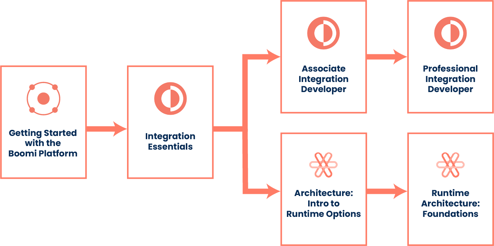

# Boomi Training and Certification

<head>
  <meta name="guidename" content="Integration"/>
  <meta name="context" content="GUID-10727153-f8bf-41bc-8741-5935e186235d"/>
</head>

Boomi's Training and Certification portal helps you build the competencies you need to be successful with Boomi. The catelog includes dozens of on-demand and self-paced courses for all Boomi services to help you build a solid foundation and earn certifications.

:::note

To access Boomi's training portal, you must have a Boomi Platform account. You can also log in with your Boomi Community credentials.

:::

Learn the basics of the Boomi Enterprise Platform with the [Getting Started with the Boomi Platform](https://community.boomi.com/s/learning-plan-detail-standard?ltui__urlRecordId=aOM6S0000008OIoWAM&ltui__urlRedirect=learning-plan-detail-standard) course and then dive into Integration with [Integration Essentials](https://community.boomi.com/s/learning-plan-detail-standard?ltui__urlRecordId=aOM6S0000008OKpWAM&ltui__urlRedirect=learning-plan-detail-standard).

After you have a comfortable grasp of Integration basics, consider exploring some of the other Integration training courses, such as:

- [Associate Integration Developer](https://community.boomi.com/s/learning-plan-detail-standard?ltui__urlRecordId=aOM6S0000008OIeWAM&ltui__urlRedirect=learning-plan-detail-standard)
- [Professional Integration Developer](https://community.boomi.com/s/learning-plan-detail-standard?ltui__urlRecordId=aOM6S0000008OJrWAM&ltui__urlRedirect=learning-plan-detail-standard)
- [Architecture: Introduction to Runtime Options](https://community.boomi.com/s/learning-plan-detail-standard?ltui__urlRecordId=aOM6S0000008OJSWA2&ltui__urlRedirect=learning-plan-detail-standard)
- [Runtime Architecture: Foundations](https://community.boomi.com/s/learning-plan-detail-standard?ltui__urlRecordId=aOM6S000000PAsXWAW&ltui__urlRedirect=learning-plan-detail-standard)

