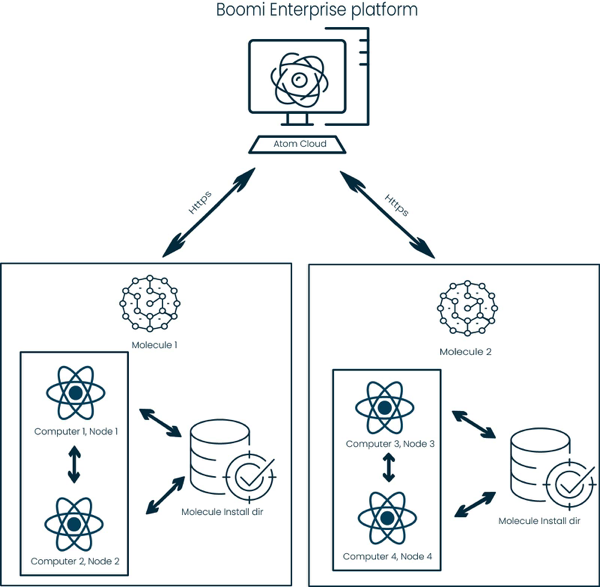

# Jumpstart your journey with Integration 

<head>
  <meta name="guidename" content="Integration"/>
  <meta name="context" content="GUID-f88eb1a8-beee-4fc7-92f2-1302553979f9"/>
</head>

Boomi Integration simplifies your business needs by allowing you to integrate software and hardware into an overall system. Our intuitive user interface makes creating integration simple and easy.

## Build processes

You can use the [process library](../Integration%20management/c-atm-Process_libraries_8afa6002-d3a9-4e4d-93fb-1aada133ca31.md) to choose from different pre-built processes or you can use the [Quick Start](https://www.youtube.com/watch?v=DXsOJaq4DhE&list=PL4f0Zwq9gwOnVGa-GiSRQvt1omL0uUGpM&index=7) wizard to build your entire process, from start to finish. You can also use [Boomi GPT](/docs/Atomsphere/Platform/atm-BoomiAI_BoomiGPT.md) to create the integrations for you, using prompts and generative AI. 

For a more general overview, refer to the [Getting started with Integration](../Getting%20started/c-atm-Integration_and_iPaaS_257fcf2c-7e93-48d0-be67-bd53fb444930.md) page.

### Connect steps

The [process canvas](../Process%20building/c-atm-Process_canvas_7092acce-da3a-4bf1-9130-ac2b74eebd22.md), introduces you to [process steps](../Process%20building/r-atm-Process_shapes_79b3f010-5269-46cf-95d1-db2387afe0f4.md) that you can connect to build your integration processes and then [configure](../Process%20building/c-atm-Component_configuration_8e1b4740-6530-4e7e-9d6b-79a43b290343.md) to suit your needs. A step dictates how a process can retrieve, manipulate, and send data from a source to a destination. There are four categories of process steps.

- The [Start step](../Process%20building/r-atm-Start_shape_7561792f-f0b8-41f5-b06d-06e2bde5b0e5.md) is the Special step that begins every process. It’s included in the process canvas by default and cannot be removed.
- [Execution steps](../Process%20building/r-atm-Execute_shapes_1bcfafd3-d821-437e-88f0-ad10c9526eaf.md) manipulate the document data.
- [Logic steps](../Process%20building/r-atm-Logic_shapes_7a64683e-8ddc-4606-97b4-497867883094.md) direct the flow of documents through the process.
- [Connector steps](../Process%20building/r-atm-Connector_shape_5db07b4d-02a2-4438-9103-153c13312ffe.md) retrieve and send data into or out of the process.

<iframe width="700px" height="400px" src="https://embed.app.guidde.com/playbooks/qkhpRwfSek1kPrRXPDTpSo" title="Simple integration" frameborder="0" referrerpolicy="unsafe-url" allowfullscreen="true" allow="clipboard-write" sandbox="allow-popups allow-popups-to-escape-sandbox allow-scripts allow-forms allow-same-origin allow-presentation"></iframe>

<!-- ## Configuring your connections

As you go along  building your process and connecting your steps, you have to configure each step to suit your needs. To configure your step click on it and a dialog opens up with different options. See the below topics for further details

- [Component configuration](../Process%20building/c-atm-Component_configuration_8e1b4740-6530-4e7e-9d6b-79a43b290343.md)
- [Configuration of web service listen connections](../Event-based%20integration/API%20Management/c-atm-Configuration_of_web_service_listen_connections_0e7993f9-dee7-4348-8ce1-6bf52f23dd43.md)
- [Dynamic Process Connection properties](../Process%20building/int-Dynamic_Process_Connection_properties_9067300c-3df3-40ba-97b3-5a6a03a3a6dc.md)
- [Connectors](../Connectors/c-atm-Connectors_bb305b35-0f13-4937-a918-f85dbbe1b27b.md)
-->

:::tip 
After creating your process, you can also convert data from one format to another and create entirely new documents by using the [Map components](../Process%20building/c-atm-Map_components_87f669d6-4999-445f-9f29-ed24e79c92dd.md). You have the option to manually choose which elements you want to map, or you can use Boomi Suggest to map elements for you. You can also create a [Profile component](../Process%20building/c-atm-Profile_components_e9b3ea44-7b4a-4d1e-8185-e09e429275f6.md) to describe the layout or format of your document. 
::: 

<!-- Below are some links to get your started. 

- [Map Components](../Process%20building/c-atm-Map_components_87f669d6-4999-445f-9f29-ed24e79c92dd.md)
- [Map function components](../Process%20building/r-atm-Map_Function_components_d209f3e8-3094-42de-a504-2f2dc33ab15c.md)
- [Mapping elements from source to destination](../Process%20building/t-atm-Mapping_elements_from_source_to_destination_663f84fd-7b4a-4cd7-803b-715ee2bd3453.md)

### Creating profiles 

Profiles are used in maps and describe the layout or format of documents read into or sent out of processes. Profiles contain two [data types](../Process%20building/c-atm-Data_Types_f79b7a73-0bdc-4b4b-bbad-de622f6e280c.md) and can also be imported from an existing file; like a database or an XML file. View [Profile components](../Process%20building/c-atm-Profile_components_e9b3ea44-7b4a-4d1e-8185-e09e429275f6.md) for more information on profile types and import options. 
-->

## Set up your runtime environment

To test and deploy your process, you need to set up your runtime environment.  Setting up your runtime environment means you must install and configure an  [Atom, Molecule, or Atom Cloud](../Getting%20started/int-Atoms_Molecules_and_Atom_Clouds_d8fe8ad8-3ba5-4eb1-967d-cd0fc9ffb062.md). 

An Atom is a single-tenant runtime with no high availability functionality. A Molecule is also a single-tenant runtime but with multiple nodes that provide high functionality. An Atom Cloud is a multi-tenant runtime with multiple nodes, so there’s greater flexibility of use. 

For more information on how to set up your runtime environments, refer to these topics: 

- [Atom, Molecule, and Atom Cloud setup](../Atom,%20Molecule,%20and%20Atom%20Cloud%20setup/int-Atom_Molecule_and_Atom_Cloud_setup_60a6c21e-add1-44b7-a549-1067b864404b.md)
- [Methods for installing Atoms, Molecules, and Atom Clouds](../Atom,%20Molecule,%20and%20Atom%20Cloud%20setup/c-atm-Methods_for_installing_Atoms_Molecules_and_Clouds_2579bb82-4589-4834-968a-93300a90e04e.md)

## Test and deploy 

By switching to test mode, you have the ability to test your process right in the Build page, without the need to deploy it to your production environment. Refer to the topics below for further details.

- [Process testing](../Process%20building/c-atm-Process_testing_d7682d9d-8515-4069-a6da-132880d29755.md)
- [Test mode and the Test Atom Cloud](../Process%20building/c-atm-Test_Mode_and_the_Test_Cloud_592b6741-ff57-4d08-a938-2f4f82d84d51.md)
- [Deployment](../Deployment/c-atm-Deployment_4e723d20-3e2b-41b7-8d57-010dccb940b8.md)

## Manage and troubleshoot 

[Integration management](../Integration%20management/c-atm-Integration_management_0813cac4-8c50-4247-a63f-f51044594623.md) lets you manage and troubleshoot any errors in the Manage menu. From this menu you can view the results of your process executions and troubleshoot errors, administer atoms, execute processes manually, and view process logs and activity for all your Atoms. Refer to the following topics for more information.

- [Process reporting](../Integration%20management/c-atm-Process_reporting_c49a74c4-026d-4c0d-a69e-4fca30ed34a3.md)
- [Atom management](../Integration%20management/c-atm-Atom_Management_b38a3a90-d7f6-4df0-8c00-e75a178dfdfa.md)
- [Boomi Assure](../Process%20building/c-atm-Boomi_Assure_977eeb59-213e-4a02-ae8b-beaaba4e2ab1.md)
- [Process Library](../Integration%20management/c-atm-Process_libraries_8afa6002-d3a9-4e4d-93fb-1aada133ca31.md)
- [Trading Partner Management](../Integration%20management/c-atm-Trading_Partner_Management_0a507db2-bd16-4d67-9213-4606ab7c46f0.md)

## Next steps

Boomi offers you many other services and resources to aid in building and managing your processes.  
Below are some of the different areas within Boomi that you can visit to view next steps. 
 
**Help documentation**
- [Building a Boomi Integration](/docs/Atomsphere/Integration/Getting%20started/int-Building_a_Boomi_Integration.md) 
- [Integration Workflow](/docs/Atomsphere/Integration/Getting%20started/c-atm-Integration_Workflow_0ff5baa9-222d-4c9a-b97a-982cef8b6d9d.md) 

**Community knowledge articles and trainings** 
- [Start Integrating with Boomi](https://community.boomi.com/s/article/ka26S000000K1k6QAC)
- [Integration Essentials: Working with steps - Training question](https://community.boomi.com/s/question/0D56S0000BtiYRcSQM) 
- [Boomi Integration Developer 1 Training](https://community.boomi.com/s/question/0D51W00006ArzchSAB)

**Other services integration works with**
- [Getting started with Boomi API Management](/docs/Atomsphere/API%20Management/Topics/c-api-Getting_Started_f06ad982-c0d9-4c67-ab0f-7a19db534868.md) - Create, deploy, and manage APIs.
- [Getting started with Boomi Master Data Hub](/docs/Atomsphere/Master%20Data%20Hub/Getting%20started/c-mdm-Getting_started_8f98c194-2f50-4949-b42d-d3925b210d2b.md) - Synchronize and manage valuable data domains with Hub and Integration.
- [Getting started with Flow](/docs/Atomsphere/Flow/topics/c-flo-Getting_Started_f26280db-5b73-46dd-b087-4423f5dc6774.md) - Access to exchange and synchronize data between a wide range of connectors and applications, supported by Flow and Integration.