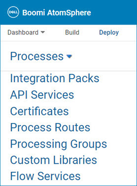
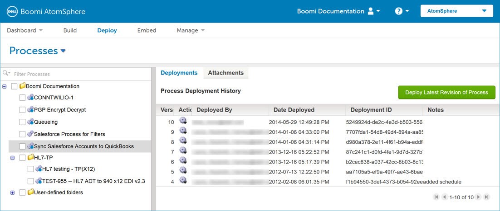

# Deploy page 

<head>
  <meta name="guidename" content="Integration"/>
  <meta name="context" content="GUID-68e4fdf6-69ec-4563-99e4-b896aeaa79e6"/>
</head>

The Deploy page is the central point in which you can attach and deploy processes, integration packs, APIs, process routes, processing groups, custom libraries, and flow services.

The **Deploy** page consists of several areas:

- **Component** list, where you select the type of component that you want to deploy

    

- **Deployments** tab, which shows the environment\(s\) to which the component is attached and its deployment history \(this tab is not available for integration packs\)

- **Attachments** tab, which shows all available Atoms or environments and can be used to attach or detach Atoms or environments

You can select one component by highlighting it or multiple components by using the check boxes.

:::note

To use API Service/Proxy components, API Management must be enabled in your account.

:::