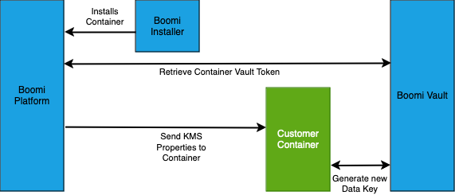
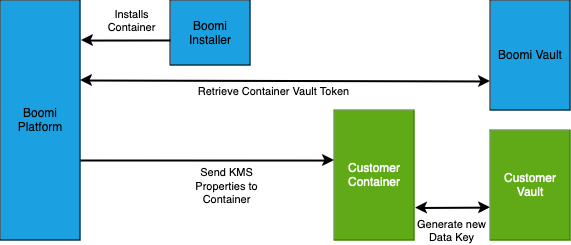
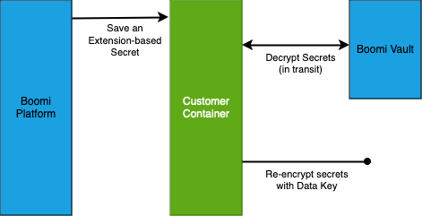
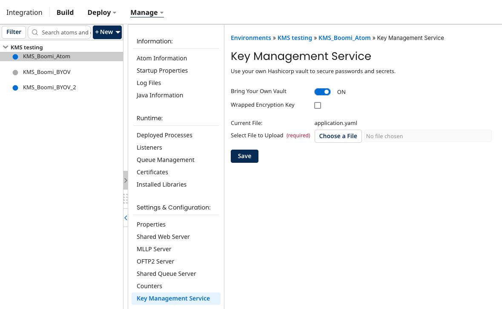

 # Boomi Key Management Service

<head>
  <meta name="guidename" content="Platform"/>
  <meta name="context" content="GUID-c70376c6-11ea-409d-b14a-9b048df2bb9a"/>
</head>

Boomi's Key Management Service (KMS) allows you to encrypt environment extension-based secrets with a key generated and managed by a Boomi hosted HashiCorp Vault instance, which improves the security of your sensitive data. You will have to provision a HashiCorp Vault instance manually if you are using our Bring Your Own Vault functionality (see comparison below).

After you mark an encrypted field, such as a password field, as extensible and save a value, the Boomi Enterprise Platform encrypts the value with a wrapped data key stored in a Boomi-managed vault. The key can be viewed only when the Atom requests the vault to decrypt it. The decrypted value is sent to the Atom without being stored on the Boomi Enterprise Platform. After the Atom accesses the stored value, the vault immediately re-encrypts the value with a new data key which it then uses to encrypt the extensions variable. This new key is unique to the Atom and is not accessible by the platform.

## Boomi Hosted Vault vs. Bring Your Own Vault

We provide two options for KMS: a fully Boomi-hosted vault, and a Boomi-hosted vault supplemented by a customer-managed vault. In both cases, the encryption in transit is handled by the Boomi-hosted vault. In the BYOV (Bring Your Own Vault) mode, secrets are re-encrypted on the customer container by the customer’s own HashiCorp Vault.

**Comparison** 

|    |  Boomi hosted vault  |  Bring Your Own Vault  |
|:---|:--:|---:|
| Configuration   |  The vault supporting KMS is fully managed by Boomi. No additional setup is required once the KMS feature is activated.  |  The vault supporting KMS on the transit side is fully managed by Boomi, but the container side vault is fully managed by the customer. Additional configuration and setup is required to enable this functionality.  |
|  Container Types  |  Supported by Boomi's full suite of runtime offerings: Atoms, Molecules and Clouds.  |  Supported by customer-hosted Atoms and Molecules. Not available for Clouds.  |
|  Encryption  |  Encryption in transit and encryption at rest are both managed by the Boomi hosted vault and data keys that it generates.  |  Encryption in transit is managed by the Boomi hosted vault. Encryption at rest is managed by the customer’s vault and data keys that it generates.  |
|  Wrapped data key support  |  Not supported. |  Encryption at rest can be configured to use HashiCorp’s wrapped data key functionality. This ensures that the container always authenticates its access to the customer’s vault before decrypting secrets. |

**Atom Installation/KMS Activation with Boomi-hosted vault**


**Atom Installation/KMS Activation with the BYOV functionality**


**Saving an Environment Extension (note: this process is the same for both the Boomi-hosted and BYOV use case)**



## Configuring Bringing your own vault

By default, KMS uses a Boomi hosted vault for the platform and the Atom. You can configure your Atom to use your own HashiCorp vault on the Atom Management settings page.

### On your HashiCorp vault instance

1. Enable HashiCorp Vault's transit secret's engine.

2. Generate a transit encryption key on your vault instance with the following name pattern: `accountID_containerID`.

  - `accountID` is your Platform account ID.
  - `containerID` is an ID for the specific runtime container that is being configured.

3. Enable the token authentication method.

4. Create the following policy. The referenced transit key is generated in step 2.

   ```` 
   Java
   {
     "path" : {
        "transit/datakey/+/accountID_containerID" : {
           "capabilities" : [ "update" ]
        },
        "auth/token/lookup-self" : {
           "capabilities" : [ "read" ]
        },
        "auth/token/renew-self" : {
           "capabilities" : [ "update" ]
        }
     }
   }
   ````

5. Create an authentication token with the policy that you created in step 4 attached.

### On the Boomi Enterprise Platform

1. In Atom Management (**Manage \> Atom Management**), select the Atom for which you want to add your own vault.

2. Under Settings & Configuration, select **Key Management Service**.

3. Turn on the toggle for **Bring Your Own Vault**.

4. Upload a properties file for your vault by clicking **Choose a File** and navigating to the location of the file. The file should be formatted similarly to the following example:

````
Unset
spring:
  cloud:
    vault:
      uri: ${VAULT_URI}
      namespace: ${VAULT_NAMESPACE}
      authentication: token
      token: ${AUTH_TOKEN}
      session:
        lifecycle:
          enabled: true
          expiry-threshold: 20s
          refresh-before-expiry: 10s

````

   - `token` - The authentication token generated in step 5 of the vault setup process.
   - `namespace` - (Optional) The namespace can be set to root `/` or `/admin`.
   - `uri` - The URL to the HashiCorp Vault being used as the BYOV server.

5. (Optional) Select the **Wrapped Encryption Key** checkbox to require the Atom to generate and use an encrypted data key.

6. Click **Save**.



## Limitations

Boomi's KMS currently has the following limitations:

- Boomi's KMS only encrypts environment extensions for connector properties with encrypted values. These fields are displayed in the UI as `<Encrypted>`
- If KMS is disabled and then re-enabled, in most cases you must re-enter the values for the environment extension-based secrets.

## Known issues

The values on the Key Management Service panel in the Boomi Enterprise Platform do not refresh automatically when you save changes. Manually refreshing the page updates the displayed values.
