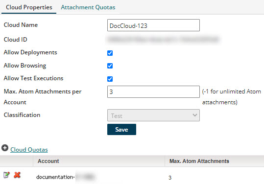

# Atom Cloud management 

<head>
  <meta name="guidename" content="Integration"/>
  <meta name="context" content="GUID-dc01f897-a4c8-462f-b6ac-ffb5cbcddb81"/>
</head>

Manage Atom Clouds and Cloud Molecules on the **Manage** \> **Cloud Management** page.

Cloud owners can:

-   Add and delete Atom Clouds \(on the Clouds tab\)

-   Install Cloud Molecules \(on the Clouds tab\)

-   Set and edit Cloud properties \(on the Cloud Properties tab\)

-   Determine how many Atoms each account can install on the Cloud \(on the Cloud Properties tab\)

-   Set and edit some properties of Cloud Molecules \(on the Attachment Quotas tab\)

-   Set and edit some properties of additional Atoms in the Cloud \(on the Attachment Quotas tab\)

Atom Clouds are set up primarily by partners who then share them with their accounts. To see this page, you must have the Cloud Management privilege and you must have Atom Clouds enabled in your account.

