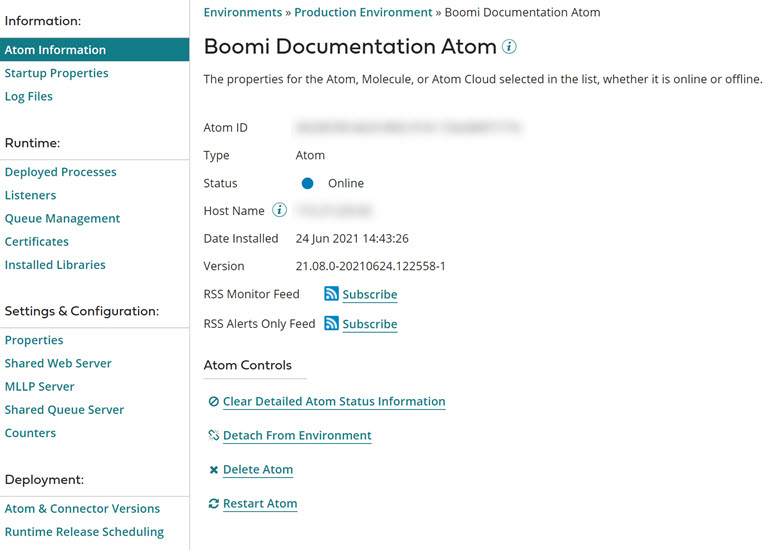

  # Atom Management 

<head>
  <meta name="guidename" content="Integration"/>
  <meta name="context" content="GUID-b38a3a90-d7f6-4df0-8c00-e75a178dfdfa"/>
</head>

In Atom Management, you can review and modify the properties and settings for Atoms, Molecules, and environments.

You can also review and modify some properties and settings for Cloud Molecule and Cloud Attachment.

To modify the properties and settings on this page \(**Manage** \> **Atom Management**\), you must have the Atom Management privilege. If you have the Atom Management Read Access privilege, you can review the properties and settings but not modify them.

:::note

Atom Management panels that are not yet available to users with the Read Access privilege are not enabled in the UI.

:::

Depending on which Atom Management privilege you have, you can do some or all of the following for an Atom, Molecule, Cloud Molecule, or Cloud Attachment in the Atoms list:

-   Monitor its status.

-   Review its startup properties.

-   Change some of its properties, download logs, view and update counters, and subscribe to notifications.

-   Access web server, queue server, and MLLP server settings \(if these features are enabled in the account\).

-   Check the status of individual nodes, head node, or delete nodes in a Molecule or Atom Cloud (Cloud Molecule or Cloud Attachment) on the Cluster Status panel.

-   Get pending updates to Atoms, Molecules, Cloud Attachments, Cloud Molecules, and connectors prior to the full release. If you change your mind, you can roll back the updates prior to the full release.

-   Set a schedule for receiving updates \(if this feature is enabled in the account\).

-   Review the release status of integration packs to which the Atom, Molecule, Cloud Attachment, or Cloud Molecule is attached and, if needed, apply updates \(if this feature is enabled in the account\).

-   Review a list of deployed processes, and stop, add, edit, or resume deployed process schedules.

-   Review information about deployed certificates, including certificates that have expired or are about to expire.

-   Review the status of listeners and, if needed, pause, resume, or restart all or selected listeners.

-   Review a list of installed JAR files.

-   Check the status of a Atom Cloud’s Atom workers and stop an Atom worker on the Atom Workers panel.

You can also do some or all of the following for an environment in the Environments list:

-   Review the environment’s properties and, if needed, change some of them.

-   Set environment extensions.

-   Attach Atoms.

-   Assign user roles.

-   Review the release status of integration packs to which the environment is attached and, if needed, apply updates.